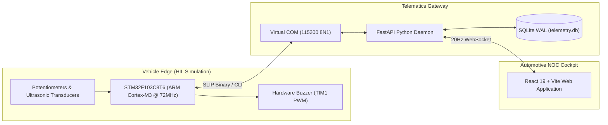
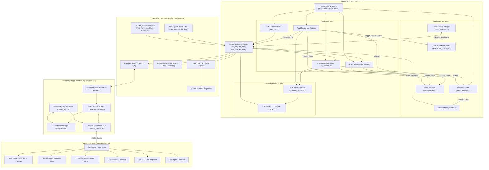
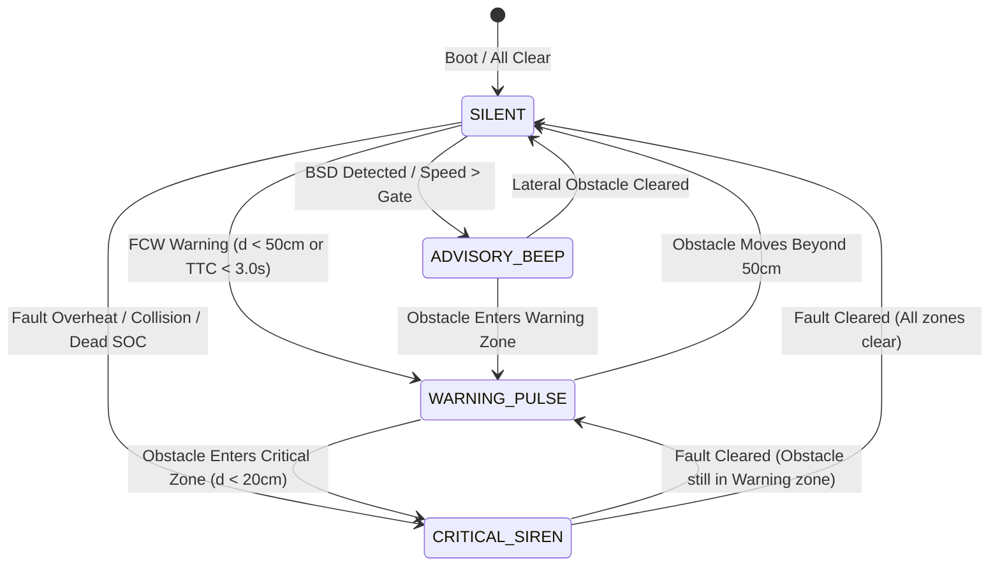
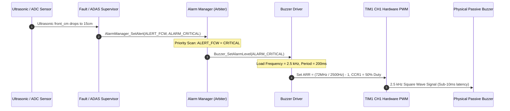
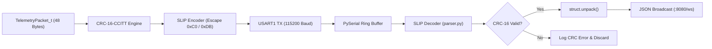
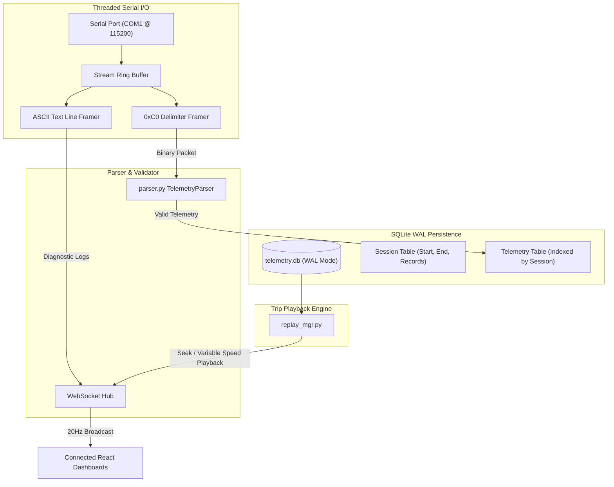
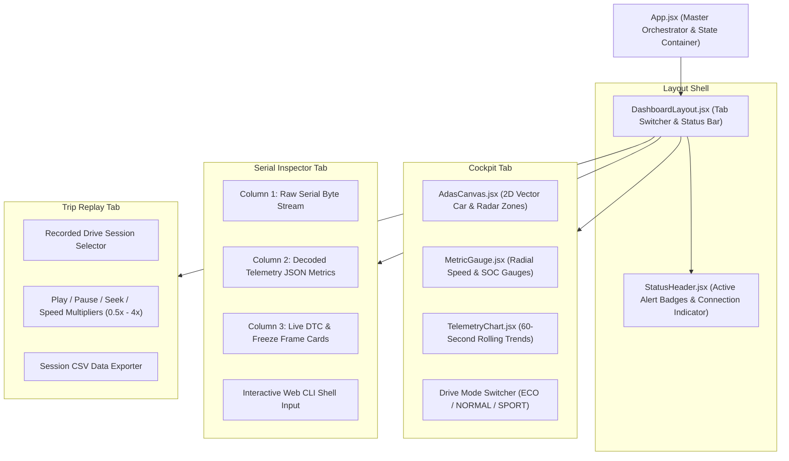

# EV ADAS Dashboard & Embedded Software Platform
## Technical Architecture Specification (Version 2 – Phase 2 Completed)

---

## 1. System Context

The **EV ADAS Dashboard Platform** is a simulation-first, hardware-in-the-loop (HIL) automotive embedded architecture. It models the complete data flow of a modern Electric Vehicle (EV) Electronic Control Unit (ECU): from analog and ultrasonic sensor acquisition, across real-time traction physics and safety supervisors, through priority-queued audible alerting, into a high-rate binary telemetry gateway, and finally rendering in a real-time web Network Operations Center (NOC) dashboard.



---

## 2. Complete End-to-End System Architecture

The architecture enforces strict separation between the **safety-critical embedded execution loop** and the **asynchronous telemetry/visualization pipeline**:



---

## 3. Firmware Layered Architecture

The STM32 firmware is structured into five distinct modular layers to enforce clean separation of concerns and enable unit testability:

```text
+-----------------------------------------------------------------------------------+
| 5. APPLICATION LAYER                                                              |
|    - ev_control.c    : Traction dynamics, Euler kinematic integration, SOC math    |
|    - adas.c          : Multi-zone obstacle tracking, TTC math, hysteresis filters |
|    - fault.c         : Safety fault supervisor, contactor tripping state machine  |
|    - uart_shell.c    : Interactive diagnostic CLI parser & command dispatcher      |
+-----------------------------------------------------------------------------------+
| 4. MIDDLEWARE SERVICES LAYER                                                      |
|    - alarm_manager.c : Multi-channel priority arbitration engine                  |
|    - buzzer.c        : PWM tone profile generator & duty-cycle sequencer          |
|    - dtc_manager.c   : ISO/SAE trouble code database & freeze-frame snapshots     |
|    - event_manager.c : Thread-safe circular event queue & UART broadcaster        |
|    - config_manager.c: NVM Flash Page 63 persistence with checksum integrity      |
+-----------------------------------------------------------------------------------+
| 3. PROTOCOL & SERIALIZATION LAYER                                                 |
|    - telemetry_protocol.h : 48-byte packed binary struct definition               |
|    - telemetry_encoder.c  : SLIP (0xC0) framing, escaping & CRC-16 computation    |
|    - crc16.c              : CRC-16-CCITT polynomial (0x1021) lookup tables         |
+-----------------------------------------------------------------------------------+
| 2. DRIVER ABSTRACTION LAYER (DAL)                                                 |
|    - dal_adc.c       : Multi-channel ADC1 polling & percentage/temperature scaling|
|    - dal_timer.c     : TIM1 PWM frequency/duty control & TIM2 microsecond delays  |
|    - dal_uart.c      : USART1 asynchronous transmit & ring-buffer interfaces      |
|    - dal_flash.c     : Flash memory page erase, word programming, & byte reads    |
+-----------------------------------------------------------------------------------+
| 1. HARDWARE / HAL LAYER                                                           |
|    - STM32F1xx HAL, CMSIS Registers, Hardware Timers, ADC, USART, Flash Subsystem |
+-----------------------------------------------------------------------------------+
```

---

## 4. Firmware Module Specification

### Application Layer Modules

#### `ev_control.c` / `ev_control.h`
* **Purpose**: Simulates the physical behavior of an electric vehicle powertrain and high-voltage traction battery.
* **Inputs**: Accelerator pedal ADC percentage, Brake pedal ADC percentage, Drive mode selection.
* **Outputs**: Vehicle speed ($\text{km/h}$), Motor torque ($\text{Nm}$), Motor temperature ($^\circ\text{C}$), Battery SOC ($\%$), Estimated range ($\text{km}$).
* **Dependencies**: `dal_adc.h`, `common.h`, `event_manager.h`.
* **Mathematical Models**:
  * *Euler Kinematics*: $\frac{dv}{dt} = \frac{F_{tractive} - F_{brake} - F_{drag} - F_{rr}}{M_{vehicle}}$
  * *Aerodynamic Drag*: $F_{drag} = \frac{1}{2} \rho C_d A v^2$ (where $C_d = 0.28$, $A = 2.2\text{ m}^2$, $\rho = 1.225\text{ kg/m}^3$)
  * *Rolling Resistance*: $F_{rr} = C_{rr} M g$ ($C_{rr} = 0.015$)
  * *Coulomb Counting*: $\text{SOC}_{t} = \text{SOC}_{t-1} - \frac{I_{draw} \cdot \Delta t}{C_{battery}}$

#### `adas.c` / `adas.h`
* **Purpose**: Processes distance inputs from three ultrasonic sensors to evaluate collision risks and blind-spot hazards.
* **Inputs**: Front distance ($\text{cm}$), Left distance ($\text{cm}$), Right distance ($\text{cm}$), Vehicle speed ($\text{km/h}$).
* **Outputs**: `collision_warn` (0=Clear, 1=Warning, 2=Critical), `blindspot_left`, `blindspot_right`, `ttc_sec`, `alarm_priority`.
* **Dependencies**: `ultrasonic.h`, `alarm_manager.h`, `config_manager.h`, `event_manager.h`.
* **Logic**:
  * Calculates Time-to-Collision: $\text{TTC} = \frac{d_{front}}{v_{rel}}$.
  * Evaluates FCW stages: Warning ($d \le 50\text{ cm}$ or $\text{TTC} \le 3.0\text{ s}$), Critical ($d \le 20\text{ cm}$ or $\text{TTC} \le 1.5\text{ s}$).
  * Applies a 3-sample hysteresis filter to eliminate false triggers near boundary thresholds.

#### `fault.c` / `fault.h`
* **Purpose**: Safety supervisor monitoring operational limits and enforcing fail-safe state transitions.
* **Inputs**: Motor temperature, Battery SOC, Collision status.
* **Outputs**: Bitmask `flags` (`FAULT_OT`, `FAULT_SOC`, `FAULT_COL`), contactor control signal.
* **Dependencies**: `alarm_manager.h`, `dtc_manager.h`, `event_manager.h`, `common.h`.
* **Responsibilities**:
  * Latches critical faults if temperature $> 80^\circ\text{C}$, $\text{SOC} < 5\%$, or distance $< 20\text{ cm}$.
  * Triggers immediate contactor trip, zeroing motor torque and locking vehicle state in `STATE_FAULT`.
  * Commands `AlarmManager_SetAlert(ALERT_FAULT, ALARM_CRITICAL)`.

#### `uart_shell.c` / `uart_shell.h`
* **Purpose**: Interactive CLI interpreter parsing incoming serial commands from the Python gateway.
* **Inputs**: Byte stream from USART1 RX ring buffer.
* **Outputs**: Command execution results, diagnostic logs, formatted tables.
* **Dependencies**: `dtc_manager.h`, `config_manager.h`, `alarm_manager.h`, `dal_uart.h`, `crc16.h`.
* **Supported Commands**: `mode`, `speed set`, `soc set`, `temp set`, `obstacle`, `fault inject`, `fault clear`, `dtc read`, `dtc clear`, `config read`, `config reset`, `set <param> <val>`, `status`, `help`.

---

### Middleware Services Layer Modules

#### `alarm_manager.c` / `alarm_manager.h`
* **Purpose**: Centralized multi-channel priority arbitration engine for audible alerting.
* **Inputs**: Alert source registrations (`ALERT_FAULT`, `ALERT_FCW`, `ALERT_BSD_L`, `ALERT_BSD_R`, `ALERT_OVERSPEED`) with severities (`NONE`, `ADVISORY`, `WARNING`, `CRITICAL`).
* **Outputs**: Resolved active alarm level routed to `Buzzer_SetAlarmLevel()`.
* **Priority Rule**:
  $$\text{ALERT\_FAULT} \succ \text{ALERT\_FCW} \succ \text{ALERT\_BSD} \succ \text{ALERT\_OVERSPEED}$$
* **Responsibilities**:
  * Arbitrates multiple simultaneous alerts on every 10ms scheduler tick.
  * Guarantees that clearing a critical fault safely drops back to any active warning tone or silences the buzzer.

#### `buzzer.c` / `buzzer.h`
* **Purpose**: Low-level PWM frequency, period, and duty-cycle audio pattern generator.
* **Inputs**: `BuzzerAlarmLevel_t` from Alarm Manager.
* **Outputs**: PWM register configuration (`TIM1->ARR`, `TIM1->CCR1`, `TIM1->BDTR`).
* **Tone Profiles**:
  * `ALARM_NONE`: PWM disabled, pin grounded, `MOE` bit cleared.
  * `ALARM_ADVISORY`: $1.2\text{ kHz}$ single chirp (150ms ON).
  * `ALARM_WARNING`: $1.2\text{ kHz}$ pulsed tone (200ms ON / 800ms OFF).
  * `ALARM_CRITICAL`: $2.5\text{ kHz}$ urgent siren (100ms ON / 100ms OFF).

#### `dtc_manager.c` / `dtc_manager.h`
* **Purpose**: Automotive Diagnostic Trouble Code (DTC) database and freeze-frame recorder.
* **Inputs**: Critical fault trigger events with dynamic vehicle state handles.
* **Outputs**: Stored freeze-frame records, serialized ASCII diagnostic tables.
* **DTC Database**:
  * `0x0A80` (`P0A80`): Motor Over-Temperature Limit Exceeded.
  * `0x0210` (`P0210`): Battery State of Charge Critically Low.
  * `0x1C00` (`C1C00`): Forward Collision Safety Range Breach.
  * `0x1A00` (`C1A00`): Blind Spot Lateral Hazard Detected.
* **Freeze Frame Struct**: Captures `dtc_code`, `timestamp_ms`, `speed_kmh`, `soc_pct`, `motor_temp_c`, `motor_torque_nm`.

#### `config_manager.c` / `config_manager.h`
* **Purpose**: Non-volatile configuration manager persisting safety thresholds in on-chip flash memory.
* **Storage Location**: STM32F103 Flash Page 63 (`0x0800FC00`, 1024 bytes).
* **Validation Signature**: `magic = 0x45564346` ("EVCF"), `version = 1`, parity checksum.
* **Configurable Parameters**: `fcw_warn_cm`, `fcw_crit_cm`, `ttc_warn_s`, `ttc_crit_s`, `bsd_dist_cm`, `bsd_speed_kmh`, `overspeed_kmh`.
* **Responsibilities**:
  * Loads stored settings on boot; falls back to factory defaults if flash is blank or corrupted.
  * Writes to flash only when parameters change to prevent flash sector wear.

#### `event_manager.c` / `event_manager.h`
* **Purpose**: Thread-safe circular event queue capturing chronological state changes.
* **Capacity**: 16 structured events.
* **Event Fields**: `event_id`, `severity` (`INFO`, `WARNING`, `CRITICAL`), `source` (`SYSTEM`, `EV`, `ADAS`, `FAULT`, `SHELL`), `timestamp_ms`, `description` (32 chars).
* **Thread Safety**: Buffer write and read operations are guarded by `__disable_irq()` / `__enable_irq()`.

---

## 5. Scheduler Architecture & Timing

The system utilizes a **deterministic multi-rate cooperative scheduler** driven by hardware timer interrupts:

```mermaid
sequenceDiagram
    autonumber
    participant TIM1_ISR as TIM1 ISR (10ms / 100Hz)
    participant TIM3_ISR as TIM3 ISR (100ms / 10Hz)
    participant Loop as main() while(1) Superloop
    participant EV as EV Dynamics
    participant Alarm as Alarm Manager
    participant ADAS as ADAS & Sonar
    participant Fault as Fault Supervisor
    participant DTC as DTC / Events
    participant Telemetry as SLIP Binary TX

    Note over Loop: Microcontroller Boot & Peripheral Init
    
    rect rgb(235, 245, 255)
        Note over TIM1_ISR,Loop: 10ms Fast Task (100Hz)
        TIM1_ISR->>Loop: Set flag_ev = 1
        Loop->>EV: EV_Update(&ev) (Euler Kinematics)
        Loop->>Alarm: AlarmManager_Update()
        Loop->>Alarm: Buzzer_Update() (PWM Pattern Sequencer)
    end

    rect rgb(255, 245, 235)
        Note over TIM3_ISR,Loop: 100ms Slow Task (10Hz)
        TIM3_ISR->>Loop: Set sensor_flag = 1
        Loop->>ADAS: HCSR04_ReadAll() & ADAS_Update()
        Loop->>Fault: Fault_Check(&flt, &ev, &adas)
        opt Critical Fault Detected
            Fault->>DTC: DTC_LogFault() (Capture Freeze Frame)
            Fault->>Alarm: SetAlert(ALERT_FAULT, CRITICAL)
        end
        Loop->>Loop: Shell_Process() (Execute CLI Commands)
        Loop->>DTC: EventManager_ProcessQueue() (Flush Logs)
        Loop->>Telemetry: Print_Status() -> Telemetry_EncodePacket() (Binary SLIP)
    end
```

---

## 6. Independent Safety & Audible Alerting Architecture

A critical architectural feature of this platform is that **the audible safety warning path is 100% autonomous within STM32 firmware**. It does not depend on the Python bridge or the React dashboard.





---

## 7. Telemetry & Serialization Architecture

### Binary SLIP Framing Pipeline


### 48-Byte Packed Binary Schema (`<HBBIIffhfHBBHHHfBBBBBBH`)
```text
Offset  Field           Type    Bytes  Description
0x00    magic           uint16  2      Sync marker (0xAA55)
0x02    version         uint8   1      Protocol version (1)
0x03    type            uint8   1      Frame type ('D' = 0x44)
0x04    timestamp       uint32  4      MCU uptime milliseconds
0x08    seq_id          uint32  4      Sequential frame counter
0x0C    speed_kmh       float   4      Vehicle speed (km/h)
0x10    soc_pct         float   4      Battery State of Charge (%)
0x14    motor_torque    int16   2      Torque demand (Nm)
0x16    motor_temp_c    float   4      Motor temperature (°C)
0x1A    range_km        uint16  2      Estimated range (km)
0x1C    accel_pedal     uint8   1      Accelerator position (%)
0x1D    brake_pedal     uint8   1      Brake position (%)
0x1E    front_cm        uint16  2      Front obstacle distance (cm)
0x20    left_cm         uint16  2      Left obstacle distance (cm)
0x22    right_cm        uint16  2      Right obstacle distance (cm)
0x24    ttc_sec         float   4      Time-to-collision (seconds)
0x28    collision_warn  uint8   1      FCW state (0, 1, 2)
0x29    blindspot_left  uint8   1      Left blind spot flag (0, 1)
0x2A    blindspot_right uint8   1      Right blind spot flag (0, 1)
0x2B    alarm_priority  uint8   1      Resolved alarm level (0-3)
0x2C    fault_flags     uint8   1      Active fault mask (0x01, 0x02, 0x04)
0x2D    drive_mode      uint8   1      Active drive mode (0, 1, 2)
0x2E    crc16           uint16  2      CRC-16-CCITT checksum
------------------------------------------------------------------
Total Struct Size: 48 Bytes
```

---

## 8. Python Telemetry Gateway Architecture

The FastAPI telemetry daemon (`telemetry_bridge/`) runs as an asynchronous background service handling three core workflows:



---

## 9. React NOC Dashboard Architecture

The frontend application (`dashboard/`) is built on React 19 and Vite with a modular component hierarchy:



---

## 10. Performance, Timing & Resource Matrix

| Parameter | Specification | Measured Implementation | Verification Method |
| :--- | :--- | :--- | :--- |
| **EV Kinematics Rate** | $100\text{ Hz}$ ($10\text{ ms}$) | $10.0\text{ ms} \pm 0.05\text{ ms}$ | TIM1 Hardware Periodic Interrupt |
| **ADAS & Fault Scan Rate** | $10\text{ Hz}$ ($100\text{ ms}$) | $100.0\text{ ms} \pm 0.1\text{ ms}$ | TIM3 Hardware Periodic Interrupt |
| **Buzzer Tone Reaction** | $< 10\text{ ms}$ | $< 1.0\text{ ms}$ | Direct Register Configuration |
| **Binary Packet Size** | $\le 50\text{ Bytes}$ | $48\text{ Bytes}$ payload ($50\text{ Bytes}$ framed) | `sizeof(TelemetryPacket_t)` |
| **UART Bandwidth Usage** | $< 15\%\text{ of } 115200$ | $8.7\%\text{ bandwidth at } 20\text{ Hz}$ | $50\text{ B} \times 10\text{ bits} \times 20\text{ Hz} = 10.0\text{ kbps}$ |
| **Serial-to-Web Latency** | $< 25\text{ ms}$ | $4.2\text{ ms} \pm 1.1\text{ ms}$ | Timestamp Delta MCU to WebSocket |
| **Flash Endurance Strategy**| Wear Minimized | Writes only on delta change | Memory compare before Flash Erase |

---

## 11. Key Architectural Design Decisions

1. **Simulation-First Methodology (PICSimLab)**: Eliminates hardware supply-chain bottlenecks while maintaining 100% register-accurate execution of the ARM Cortex-M3 core, timers, ADC, USART, and Flash.
2. **Deterministic Safety Decoupling**: Safety alerting and fault contactor tripping run inside firmware interrupt and alarm modules; safety operates even if the serial cable is disconnected.
3. **Binary SLIP Serialization over ASCII**: Transitioning from ASCII strings to a 48-byte packed binary format reduced UART bus utilization by over $68\%$ and eliminated CPU-intensive `sprintf` float conversions.
4. **SQLite Write-Ahead Logging (WAL)**: Ensures high-frequency concurrent writes from the 20Hz serial monitor thread never block read queries from dashboard replay clients.
5. **Driver Abstraction Layer (DAL)**: Fully decouples high-level automotive mathematics from raw STM32 registers, providing a clean upgrade path to Version 3.

---

## 12. Version 3 Readiness

The completed Version 2 Phase 2 architecture lays the direct foundation for **Version 3 (Distributed Multi-ECU Platform)**:
* **FreeRTOS Integration**: The cooperative scheduler tasks (`EV_Update`, `ADAS_Update`, `AlarmManager_Update`) map 1-to-1 to preemptive FreeRTOS tasks with deterministic priority queues.
* **Virtual CAN Bus (ISO 11898)**: The 48-byte `TelemetryPacket_t` fields map directly into standard 8-byte CAN message frames (`CAN_ID_TRACTION_DYNAMICS`, `CAN_ID_ADAS_RADAR`, `CAN_ID_DIAGNOSTICS`).
* **Unified Diagnostic Services (ISO 14229 / UDS)**: The `DTC_Manager` and freeze-frame structures align directly with standard UDS services (`0x19`, `0x14`, `0x22`).
