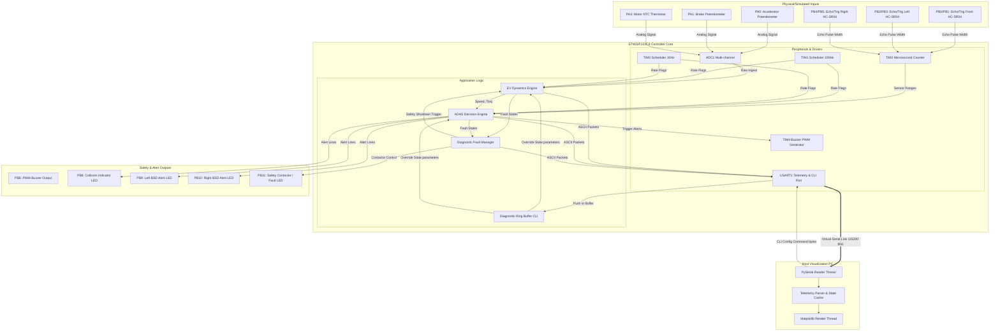
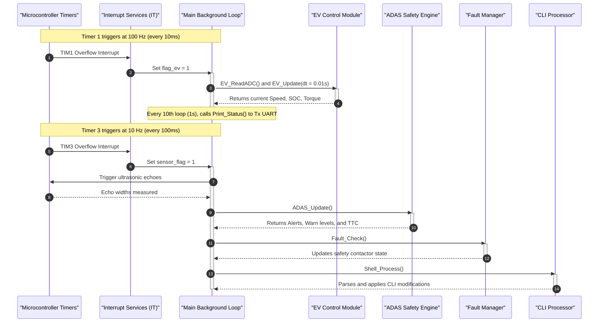
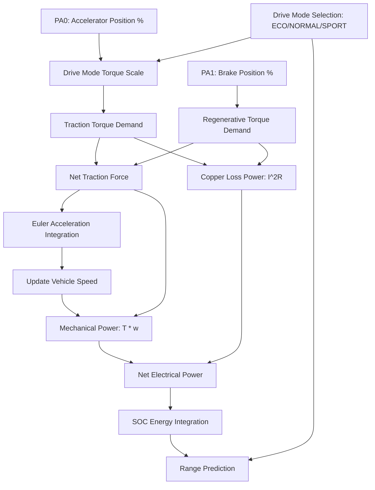
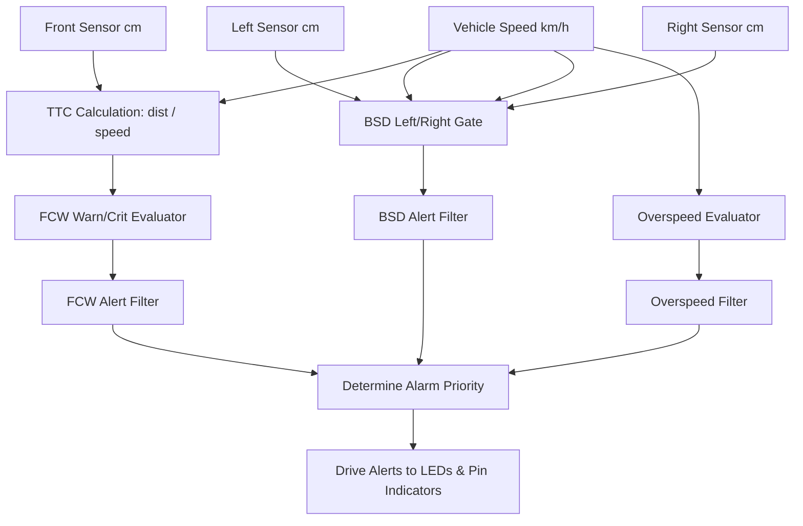
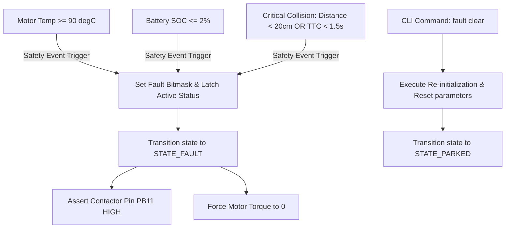
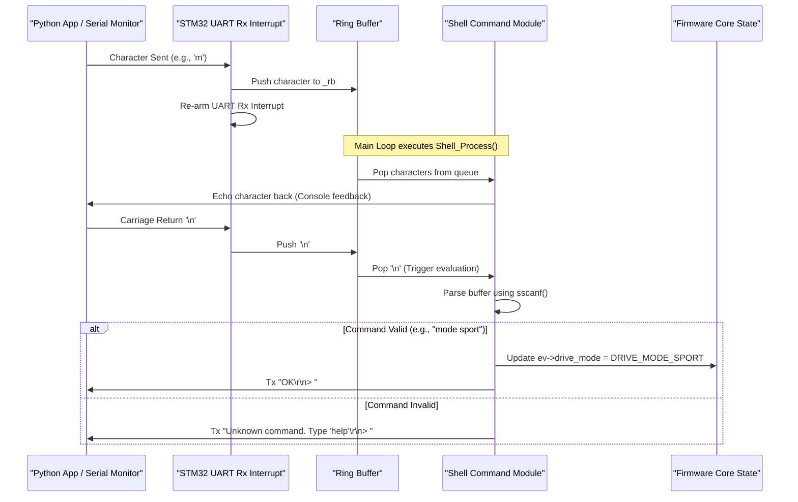
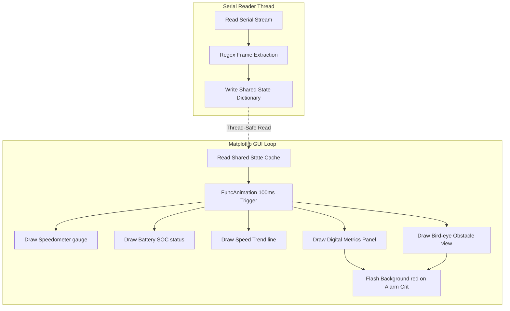
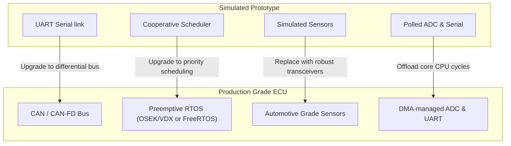

# EV ADAS High-Level & Embedded Architecture

This document provides a technical breakdown of the firmware, communication protocols, and physics models implemented in the EV ADAS Dashboard project. It is intended for embedded systems developers, firmware engineers, and system architects.

---

## 1. High-Level Architecture

The system uses a Hardware-in-the-Loop (HIL) architecture where the safety critical controller runs on an emulated ARM Cortex-M3 core, and the user interface runs on a host PC. Communication is bidirectional and asynchronous over a simulated UART serial bus.



---

## 2. Layered Architecture

The firmware is structured into standard automotive software layers to isolate hardware dependencies from the business logic:

| Layer | Files | Description |
|---|---|---|
| **Application Layer** | `ev_control.c`, `adas.c`, `fault.c` | Core logic for vehicle physics, hazard monitoring, and fault management. |
| **Communication Layer** | `uart_shell.c` | ASCII telemetry compiler and command parser. |
| **Drivers / Middleware** | `ultrasonic.c` | Hardware drivers for HC-SR04 sensors. |
| **HAL Layer** | `stm32f1xx_hal.c`, `stm32f1xx_hal_adc.c` | STMicroelectronics Hardware Abstraction Layer APIs. |
| **Hardware Layer** | `stm32f103c8tx` | Physical microcontroller registers and pins. |

---

## 3. Firmware Module Architecture

### `main.c`
The entry point of the firmware. It initializes clocks, configured peripherals, and variables. It hosts the cooperative multi-rate scheduler inside the infinite loop and defines Timer and UART interrupt callbacks.
- **Header Link**: [main.h](Core/Inc/main.h)
- **Source Link**: [main.c](Core/Src/main.c)

### `ev_control.c`
Implements the vehicle physics engine. It converts accelerator inputs to motor torque, integrates acceleration to update speed, calculates battery energy consumption, and runs the motor thermal model.
- **Header Link**: [ev_control.h](Core/Inc/ev_control.h)
- **Source Link**: [ev_control.c](Core/Src/ev_control.c)

### `adas.c`
Calculates Time-To-Collision (TTC) using ultrasonic inputs and vehicle speed, triggers blind-spot warnings based on left/right clearances, and evaluates overall alarm priorities.
- **Header Link**: [adas.h](Core/Inc/adas.h)
- **Source Link**: [adas.c](Core/Src/adas.c)

### `fault.c`
Monitors system parameters against safe operating limits. It sets active fault bits and forces the vehicle into a safe state if limits are exceeded.
- **Header Link**: [fault.h](Core/Inc/fault.h)
- **Source Link**: [fault.c](Core/Src/fault.c)

### `uart_shell.c`
Manages an interactive diagnostic shell. It processes commands char-by-char from a ring buffer, enabling parameter injection, fault simulation, and diagnostic reads.
- **Header Link**: [uart_shell.h](Core/Inc/uart_shell.h)
- **Source Link**: [uart_shell.c](Core/Src/uart_shell.c)

### `ultrasonic.c`
Handles raw HC-SR04 sensor interfaces. It sends a 10 $\mu\text{s}$ trigger pulse, measures the return echo duration using timer tick counts, and returns calculated distances.
- **Header Link**: [ultrasonic.h](Core/Inc/ultrasonic.h)
- **Source Link**: [ultrasonic.c](Core/Src/ultrasonic.c)

---

## 4. Scheduler Architecture

The system uses a rate-monotonic, cooperative multitasking scheduler powered by hardware timer interrupts. Two flags (`flag_ev` and `sensor_flag`) trigger execution loops at fixed intervals.



---

## 5. Vehicle State Machine

The vehicle state machine manages operational modes and safety transitions:

```mermaid
stateDiagram-v2
    [*] --> STATE_PARKED : System Boot
    
    note right of STATE_PARKED
        Torque demand zeroed.
        Battery energy static.
    end note
    note right of STATE_READY
        Pre-charge contactors closed.
        Traction system enabled.
    end note
    note right of STATE_DRIVING
        Acceleration maps to positive torque.
    end note
    note right of STATE_REGEN
        Brake pedal maps to negative torque.
        Battery SOC recharges.
    end note
    note right of STATE_FAULT
        Contactor tripped (PB11 High).
        Traction torque locked at 0.
    end note

    STATE_PARKED --> STATE_READY : Accelerator Pedal Above 2%
    STATE_READY --> STATE_DRIVING : Auto Transition (Traction enabled)
    
    STATE_DRIVING --> STATE_REGEN : Brake Pedal Above 5%
    STATE_REGEN --> STATE_DRIVING : Brake Pedal Below or Equal 5%
    
    STATE_DRIVING --> STATE_FAULT : Thermal Event / Critical Low SOC / Critical Collision
    STATE_REGEN --> STATE_FAULT : Thermal Event / Critical Low SOC / Critical Collision
    STATE_READY --> STATE_FAULT : Critical Fault Detected
    STATE_PARKED --> STATE_FAULT : Critical Fault Detected
    
    STATE_FAULT --> STATE_PARKED : Fault Clear Command (Variables reset)
```

---

## 6. EV Dynamics Pipeline

The physics engine simulates the mechanical and electrical characteristics of an EV powertrain:



### Key Mathematical Equations

#### 1. Torque Demand ($T_{demand}$)
Traction torque is scaled by the active drive mode (ECO: 0.6x, NORMAL: 1.0x, SPORT: 1.3x):
$$T_{traction} = \left(\frac{Pedal\%}{100}\right) \times T_{max} \times S_{mode}$$
When the brake pedal is pressed past the 5% regeneration threshold:
$$T_{regen} = -\left(\frac{Brake\%}{100}\right) \times 0.70 \times T_{regen\_max}$$

#### 2. Speed Calculation ($v_{kmh}$)
Integrated at 100 Hz using Euler integration. Net torque is adjusted for drag force:
$$\text{Drag Torque } (T_{drag}) = v_{ms} \times C_d$$
$$\text{Acceleration } (a) = \frac{T_{net} - T_{drag}}{Mass}$$
$$v_{ms} = v_{ms} + a \times dt$$
$$v_{kmh} = v_{ms} \times 3.6$$

#### 3. Power Balance & Battery SOC ($SOC_{pct}$)
Instaneous electrical power includes mechanical load and copper losses ($I^2R$, modeled as proportional to torque squared):
$$P_{mech} = T_{net} \times v_{ms} \times 10^{-3} \quad (\text{kW})$$
$$P_{loss} = \left(\frac{T_{net}}{T_{max}}\right)^2 \times 5.0 \quad (\text{kW})$$
$$P_{total} = P_{mech} + P_{loss} \quad (\text{kW})$$
$$\Delta SOC = \frac{P_{total} \times dt}{Cap_{battery} \times 3600} \times 100 \times Scale_{simulation}$$

> [!NOTE]
> The simulation scale factor (`EV_SIM_SCALE = 500.0f`) accelerates SOC depletion and regeneration rates for laboratory testing.

---

## 7. ADAS Engine

The ADAS engine monitors safety thresholds and manages alerts:



### Collision Evaluation Logic
- **Time-to-Collision (TTC)**: Calculated only if relative speed exceeds 0.5 m/s and distance is under 2.0 meters:
  $$\text{TTC} = \frac{Distance_{front} \times 10^{-2}}{v_{ms}} \quad (\text{seconds})$$
- **Hysteresis Filtering**: Prevents alert flickering near threshold boundaries. When a condition triggers, the warning latch counter is set to 3. The alert remains active until the counter counts down to 0 over subsequent safe cycles.

---

## 8. Fault Manager

The Fault Manager protects system components. It operates as a latching safety monitor:



---

## 9. UART Communication & Diagnostics

Communication with the host PC is handled by USART1. The configuration is **115200 baud, 8 data bits, no parity, 1 stop bit (8N1)**.

### CLI Interactive Sequence



---

## 10. Python Dashboard Architecture

The dashboard is built with Python 3 and runs two threads:



---

## 11. Timing Architecture

The cooperative scheduler timing is managed by three STM32 timers:

### Timer Configuration Formulas

#### 1. TIM1: 10ms Scheduler Base (100 Hz)
- **Input Clock**: APB2 Clock = 72 MHz
- **Prescaler (PSC)**: 71 (Divides clock by 72 -> 1 MHz timer clock)
- **Auto-Reload Register (ARR)**: 9999 (Counts 10,000 ticks)
$$\text{Update Frequency} = \frac{72,000,000}{(71 + 1) \times (9999 + 1)} = 100 \quad \text{Hz}$$

#### 2. TIM3: 100ms Sensor Base (10 Hz)
- **Input Clock**: APB1 Clock = 36 MHz (multiplied to 72 MHz internally for timers)
- **Prescaler (PSC)**: 7199 (Divides clock by 7200 -> 10 kHz timer clock)
- **Auto-Reload Register (ARR)**: 999 (Counts 1000 ticks)
$$\text{Update Frequency} = \frac{72,000,000}{(7199 + 1) \times (999 + 1)} = 10 \quad \text{Hz}$$

#### 3. TIM2: Ultrasonic Echo Timing (Microseconds)
- **Input Clock**: APB1 Clock = 36 MHz (multiplied to 72 MHz internally)
- **Prescaler (PSC)**: 0 (Timer runs at full 72 MHz resolution)
- **ARR**: 65535 (16-bit rollover)

> [!IMPORTANT]
> **TIM2 Microsecond Metric**:
> Because the prescaler is set to 0, TIM2 increments at 72 MHz. In `ultrasonic.c`, this timer is used for microsecond measurements:
> `pulse_us = echo_fall - echo_rise;`
> In this configuration, one increment of the counter represents 13.88 ns. When compiling measurements, ensure values are adjusted for this frequency.

---

## 12. Design Decisions

- **UART over CAN**: Selected to simplify host PC interface requirements. UART can be routed over a standard USB-to-TTL serial adapter, avoiding the need for dedicated CAN interface hardware.
- **STM32 HAL Library**: Used to improve code portability across STM32 microcontrollers.
- **Cooperative rate scheduler**: Chosen over a full RTOS (like FreeRTOS) to reduce CPU and memory overhead on the STM32F103C8T6. This approach avoids task context switching latency and fits within the device's flash memory.
- **PICSimLab**: Selected as the HIL simulation platform. It emulates MCU registers, analog input signals, and ultrasonic echo pulses, allowing testing without physical hardware.

---

## 13. Scalability & Path to Production

To transition this prototype into a production-grade automotive electronic control unit (ECU), implement the following modifications:



- **CAN Bus Migration**: Replace the UART bridge with a CAN-controller transceiver (e.g., MCP2515 or STM32 bxCAN peripheral) to broadcast vehicle parameters as CAN messages.
- **Real-Time OS Integration**: Migrate the cooperative scheduler to a preemptive operating system (such as OSEK/VDX or FreeRTOS) to enforce task priorities and meet strict timing constraints.
- **Automotive Grade Sensors**: Replace the simulated HC-SR04 sensors with LIN/CAN-based automotive ultrasonic sensors to improve environmental resilience and range accuracy.
- **DMA Offloading**: Configure DMA streams for ADC scans and UART transmissions. This reduces CPU utilization by transferring data directly to memory without processor intervention.
