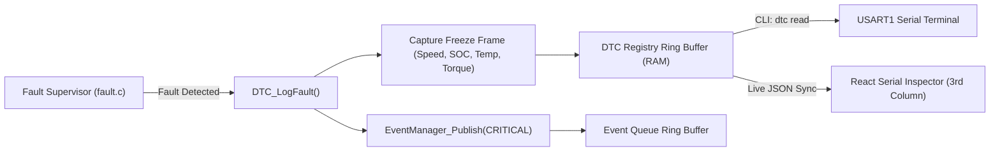

# Automotive Diagnostics & Trouble Code Specification (v2.2)

---

## 1. Overview

The EV ADAS Platform implements a standardized **Diagnostic Trouble Code (DTC)** subsystem and **Event Framework** modeled after automotive industry standards (ISO 14229 / SAE J2012). Whenever a safety supervisor detects a critical out-of-bounds parameter, the firmware records the DTC, snapshots dynamic vehicle freeze-frame telemetry, and pushes a severity event to the event queue.



---

## 2. Standardized DTC Registry

| DTC Code | Hex Value | Name | Trigger Condition | Severity | System Action |
| :--- | :---: | :--- | :--- | :--- | :--- |
| **`P0A80`** | `0x0A80` | `DTC_MOTOR_OVERHEAT` | Motor temperature $> 80.0^\circ\text{C}$ | Critical | Contactor tripped, zero torque, 2.5 kHz siren |
| **`P0210`** | `0x0210` | `DTC_BATTERY_LOW` | Traction battery $\text{SOC} < 5.0\%$ | Critical | Contactor tripped, zero torque, 2.5 kHz siren |
| **`C1C00`** | `0x1C00` | `DTC_COLLISION_LATCH`| Obstacle distance $< 20.0\text{ cm}$ | Critical | Contactor tripped, zero torque, 2.5 kHz siren |
| **`C1A00`** | `0x1A00` | `DTC_BLINDSPOT_ALERT`| Lateral hazard while speed $> 20\text{ km/h}$ | Warning | Blind spot LED active, 1.2 kHz advisory tone |

---

## 3. Freeze-Frame Data Structure

When a critical fault occurs, the DTC Manager captures an immutable freeze-frame snapshot of the vehicle state at that exact millisecond:

```c
typedef struct {
    uint16_t dtc_code;        /* Standard 16-bit DTC identifier (e.g. 0x0A80) */
    uint32_t timestamp_ms;    /* MCU uptime milliseconds when fault tripped   */
    float    speed_kmh;       /* Vehicle speed at time of fault               */
    float    soc_pct;         /* Battery State-of-Charge at time of fault     */
    float    motor_temp_c;    /* Motor temperature at time of fault           */
    int16_t  motor_torque_nm; /* Motor torque demand at time of fault         */
} DTC_FreezeFrame_t;
```

---

## 4. Event Management Framework

The `event_manager` maintains a thread-safe circular event queue capturing real-time state changes and operational logs:

### Event Structure
```c
typedef struct {
    uint16_t        event_id;         /* Monotonic event sequence counter    */
    EventSeverity_t severity;         /* INFO, WARNING, or CRITICAL          */
    EventSource_t   source;           /* SYSTEM, EV, ADAS, FAULT, or SHELL   */
    uint32_t        timestamp_ms;     /* CPU uptime timestamp                */
    char            description[32];  /* Human-readable diagnostic log       */
} EventRecord_t;
```

### Severity Levels
1. **`EVENT_SEVERITY_INFO`**: Normal operational transitions (e.g. `Drive mode changed to SPORT`, `CLI command received`).
2. **`EVENT_SEVERITY_WARNING`**: Non-latching safety advisories (e.g. `FCW warning: Obstacle approaching`).
3. **`EVENT_SEVERITY_CRITICAL`**: Latching safety shutdowns (e.g. `Motor temperature limit exceeded`, `Contactor tripped`).

---

## 5. Diagnostic CLI Commands

Users and external test harnesses can query and manipulate the diagnostic system via the UART interactive shell:

| Command | Arguments | Description | Example Response |
| :--- | :--- | :--- | :--- |
| `dtc read` | None | Dumps all recorded DTCs and freeze-frame metrics | `[DTC] Code: P0A80 | Spd: 45.2 km/h | Temp: 85.0 C | SOC: 72.0%` |
| `dtc clear` | None | Clears DTC history and freeze frames | `[DTC] All diagnostic trouble codes cleared.` |
| `fault inject` | `motor` / `soc` / `col` | Simulates an emergency fault condition | `[FAULT] Injected motor overheat condition.` |
| `fault clear` | None | Clears active fault latches and closes contactor | `[FAULT] Cleared all latching fault states.` |
| `config read` | None | Dumps all active Flash NVM safety thresholds | Parameter table formatted with whole & decimal values |
| `set` | `<param> <val>` | Updates safety threshold and persists to Flash Page 63 | `OK (Saved to NVM Flash)` |
| `config reset`| None | Restores factory default configuration | `Configuration reset to factory defaults.` |
| `status` | None | Prints overall vehicle state, drive mode, and uptime | `[STATUS] Mode: NORMAL | State: DRIVING | Uptime: 124500 ms` |
