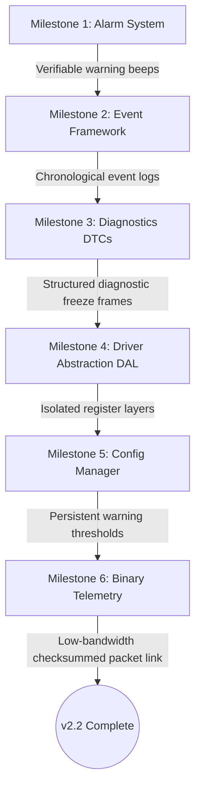

# Technical Implementation Plan: Version 2 – Phase 2

This document defines the technical design, module divisions, and execution roadmap for completing **Version 2 – Phase 2 (Simulation-Based Embedded Platform)** of the EV ADAS Dashboard. It details how the codebase transitions from a basic cooperative scheduler to an automotive-grade, modular, and event-driven software platform running inside the PICSimLab simulator.

---

## 1. Project Directory Reorganization

To support clean layering, code modularity, and separation of concerns, the firmware source files will be reorganized into the following folder structure:

```text
Core/
 ├── Application/     # High-Level Business Logic
 │    ├── ev_control.c  # Vehicle traction physics & battery dynamics
 │    ├── adas.c        # Collision warnings, BSD calculations, & range checks
 │    ├── fault.c       # Safety check loops & safe state transitions
 │    └── uart_shell.c  # Ring-buffered CLI shell interpreter
 ├── Services/        # Middleware Services & State Managers
 │    ├── alarm_manager.c # Prioritizes system warnings and drives outputs
 │    ├── event_manager.c # Circular event queue publishing system (New)
 │    ├── dtc_manager.c   # DTC registers database and freeze frames (New)
 │    └── config_manager.c# Flash parameter persistence & profile configs (New)
 ├── Drivers/         # Driver Abstraction Layer (DAL) & Device Drivers
 │    ├── dal_adc.c     # Analog-to-Digital converter wrappers (New)
 │    ├── dal_timer.c   # Hardware timers and Flash access abstractions (New)
 │    ├── dal_uart.c    # USART interrupt-driven ring buffer abstractions (New)
 │    ├── dal_flash.c   # Low-level flash page erase/write controllers (New)
 │    ├── buzzer.c      # TIM1 Channel 1 PWM audio driver (Integrated)
 │    └── ultrasonic.c  # Input Capture echo range drivers
 ├── Protocols/       # Data Serialization Formats
 │    ├── telemetry_protocol.h # Packed binary struct schemas (New)
 │    └── telemetry_encoder.c  # Packet framing & checksum validation (New)
 └── Utilities/       # Common Support Infrastructure
      ├── crc16.c       # Checksum calculators
      └── logger.c      # Level-tagged system prints (New)
```

---

## 2. Implementation Roadmap

The development sequencing is structured to prioritize **user-visible features first**, followed by **architectural middleware**, and finally **low-level refactoring and protocol communication updates**. This ensures the platform remains compile-ready and testable after every milestone.



---

## Milestone 1: Alarm System Integration

### Purpose
Establish a centralized, priority-queued audible warning system.

### Engineering Rationale
Alerts from safety faults and collision warnings are safety-critical. A centralized alarm manager ensures that high-priority states (e.g. system overtemperature) immediately suppress lower-priority alerts (e.g. blind-spot advisory) without blocking execution loops.

### Expected Architecture
```text
[Fault.c Check] ────> SetAlert(ALERT_FAULT, CRITICAL) ────┐
                                                         ▼
[Adas.c Calc] ──────> SetAlert(ALERT_FCW, WARNING) ───> [Alarm Manager] ───> SetAlarmLevel() ───> TIM1 PWM
```

### Module Scope
*   **New Modules**: `alarm_manager.c` / `alarm_manager.h`
*   **Existing Modules Affected**: `main.c`, `adas.c`, `fault.c`, `buzzer.c`

### Development Order & Implementation Tasks
1.  **Define Alert Schema**: Create `alarm_manager.h` defining the `AlertSource_t` enum (`ALERT_FAULT`, `ALERT_FCW`, `ALERT_BSD_L`, `ALERT_BSD_R`, `ALERT_OVERSPEED`) and priority hierarchies.
2.  **Develop Precedence Evaluator**: Implement `alarm_manager.c` containing an array tracking active alert states. Write a resolution scan that maps the highest active priority state to the corresponding `Buzzer_SetAlarmLevel` configuration.
3.  **Refactor Client Code**:
    *   Update [fault.c](file:///d:/Projects/Internship/Emertxe/ev_dash/Core/Src/fault.c) to call `AlarmManager_SetAlert(ALERT_FAULT, ALARM_CRITICAL)` during shutdowns, and clear it on fault recoveries.
    *   Update [adas.c](file:///d:/Projects/Internship/Emertxe/ev_dash/Core/Src/adas.c) to route FCW and blind-spot states directly to the alarm manager.
4.  **Scheduler Hook**: Bind `AlarmManager_Update()` to the 10ms cooperative scheduler loop in `main.c`.

### Validation & Simulation Testing
1.  Verify the buzzer generates warning beeps ($1.2\text{ kHz}$) when the ultrasonic sensor range drops below the threshold in PICSimLab.
2.  Trigger a thermal shutdown (PA3 potentiometer > 80°C) while the ADAS warning is active. Verify the buzzer transitions immediately to the critical siren frequency ($2.5\text{ kHz}$).
3.  Execute `fault clear` and verify the buzzer falls back to the ADAS warning tone if the obstacle is still in range, or falls silent.

### Acceptance Criteria
*   High-priority system failures override low-priority warnings.
*   System updates sound changes in less than $10\text{ ms}$ of state updates.
*   No direct calls to the hardware timer API remain inside `fault.c` or `adas.c`.

### Potential Pitfalls
*   **Audio Glitching**: Changing timer reload values mid-cycle can cause audible popping sounds. *Mitigation*: Ensure Auto-Reload Preload is enabled on TIM1 so register updates are buffered until the counter underflows.

### Future Extensibility
Provides a decoupled alert controller, allowing Version 3 to broadcast alert parameters over CAN bus without modifying sensor calculation routines.

---

## Milestone 2: Event Management Framework

### Purpose
Introduce an event-driven messaging framework to act as the diagnostic backbone of the firmware.

### Engineering Rationale
Transitioning from state polling to event-driven tracing isolates modules from telemetry formatting. Any module can publish changes (e.g. drive mode change or contactor trip) without knowing who handles the output, simplifying debugging.

### Expected Architecture
```text
[Module Action] ───> PublishEvent(Type, Severity, Source, Msg) ───> [Circular Buffer] ───> Telemetry / Debug
```

### Module Scope
*   **New Modules**: `event_manager.c` / `event_manager.h`
*   **Existing Modules Affected**: `main.c`, `ev_control.c`, `adas.c`, `fault.c`, `uart_shell.c`

### Development Order & Implementation Tasks
1.  **Define Event Metadata**: Create `event_manager.h` defining severity flags (`INFO`, `WARNING`, `CRITICAL`) and source codes.
2.  **Develop Circular Storage**: Implement a RAM-based circular event buffer to store events with milliseconds CPU timestamps.
3.  **Publish Actions**:
    *   Add event calls inside drive mode changes (`EVENT_DRIVE_MODE_CHANGED`).
    *   Add event calls inside contactor status changes (`EVENT_CONTACTOR_TRIPPED`).
    *   Add event calls inside ADAS warning transitions and CLI inputs.
4.  **Telemetry Broadcast**: Hook event dequeues to the UART print telemetry loop.

### Validation & Simulation Testing
1.  Toggle drive modes and trigger range warnings in the simulation.
2.  Open the diagnostic Web CLI, run actions, and verify that structured event messages print in real-time.

### Acceptance Criteria
*   Events log exact system timestamps.
*   The event buffer does not overflow; older messages are discarded if memory fills up.

### Potential Pitfalls
*   **Interrupt Context Collisions**: Pushing events from ISRs can corrupt the buffer indexes. *Mitigation*: Use critical section locks (`__disable_irq()`) inside buffer read/write routines.

### Future Extensibility
Prepares the logging structure for FreeRTOS Message Queues in Version 3.

---

## Milestone 3: Diagnostic System (DTC Manager)

### Purpose
Redesign fault reporting to utilize a standardized Diagnostic Trouble Code (DTC) database and freeze-frame recorder.

### Engineering Rationale
Instead of raw global boolean variables, a production automotive architecture routes faults through diagnostic layers:
```text
Fault Condition Detected ──> Publish Critical Event ──> DTC Manager ──> Capture Freeze Frame ──> Save Record
```

### Expected Architecture
```text
[Critical Event] ───> LogDTC(Code) ───> Read Dynamics Snapshot (Speed, SOC, Temp) ───> Write Freeze Frame
```

### Module Scope
*   **New Modules**: `dtc_manager.c` / `dtc_manager.h`
*   **Existing Modules Affected**: `fault.c`, `event_manager.c`, `uart_shell.c`

### Development Order & Implementation Tasks
1.  **Define Diagnostic Codes**: Map safety fault registers to standard automotive formats:
    *   `0x0A80` (Overtemperature): `DTC_MOTOR_OVERHEAT`
    *   `0x0210` (Low SOC): `DTC_BATTERY_LOW`
    *   `0x1C00` (Collision Fault): `DTC_COLLISION_LATCH`
2.  **Develop Freeze-Frame Recorder**: Implement the capture logic to read dynamic values (Speed, SOC, Temperature, Timestamp) on fault detection.
3.  **Log Integration**: Connect the DTC manager to register events of type `SEVERITY_CRITICAL`.
4.  **CLI Query Interface**: Link command handlers `dtc read` and `dtc clear` to output diagnostic histories over serial.

### Validation & Simulation Testing
1.  Force a motor overheat condition in PICSimLab (PA3 potentiometer > 80°C).
2.  Run `dtc read` in the Web CLI. Confirm it returns code `0x0A80` and displays the exact speed and battery level recorded when the fault occurred.
3.  Execute `dtc clear` and verify that the fault record clears.

### Acceptance Criteria
*   Fault entries record complete freeze-frame snapshots.
*   Historical trouble logs persist across temporary fault recoveries.

### Potential Pitfalls
*   **Diagnostic Latency**: Writing freeze frames during safety transitions must not block execution. *Mitigation*: Perform memory copies directly, keeping execution time under $1\text{ ms}$.

### Future Extensibility
Provides a diagnostic data layout directly compatible with Unified Diagnostic Services (UDS / ISO 14229) in Version 3.

---

## Milestone 4: Driver Abstraction Layer (DAL)

### Purpose
Refactor low-level hardware configurations behind standardized APIs, isolating calculation modules from direct MCU registry dependencies.

### Engineering Rationale
Refactoring peripherals after completing functional features ensures a stable baseline for regression testing. Decoupling GPIOs and ADC registers from calculation C files isolates hardware dependencies, simplifying maintenance.

### Expected Architecture
```text
[Dynamics Engine] ───> Read Channel (Pedal Pot) ───> [dal_adc.c Wrapper] ───> Low-Level HAL conversion
```

### Module Scope
*   **New Modules**: `dal_adc.c`, `dal_timer.c`, `dal_uart.c`, `dal_flash.c`
*   **Existing Modules Affected**: `main.c`, `ev_control.c`, `ultrasonic.c`, `buzzer.c`, `uart_shell.c`

### Development Order & Implementation Tasks
1.  **ADC Abstraction**: Create `dal_adc.c` wrapping multi-channel scans, providing percentages directly to `ev_control.c`.
2.  **UART Abstraction**: Create `dal_uart.c` to manage interrupts and transmit buffers asynchronously.
3.  **PWM/Timer Abstraction**: Create `dal_timer.c` wrapping output timers, isolating configuration registers from the buzzer module.
4.  **Flash Abstraction**: Create `dal_flash.c` wrapping sector write and erase handlers.

### Validation & Simulation Testing
1.  Rebuild the project and verify that the simulator compilation completes without errors.
2.  Confirm that dashboard widgets (speedometer, obstacle canvas) and buzzer tones react exactly as before.

### Acceptance Criteria
*   No calls to `HAL_ADC_PollForConversion`, `HAL_UART_Transmit`, or registers (e.g. `TIM1->ARR`) exist inside application modules.
*   System behavior is unchanged.

### Potential Pitfalls
*   **ISR Conflict**: Direct interrupts mapped to the DAL can collide if priorities are set incorrectly. *Mitigation*: Maintain original interrupt settings in the abstract wrappers.

### Future Extensibility
Enables porting the firmware to other ARM architectures (e.g. STM32F4 / STM32G4) by modifying only the DAL files.

---

## Milestone 5: Configuration Manager

### Purpose
Implement a persistent configuration manager to store ADAS warning thresholds and vehicle settings in non-volatile memory.

### Engineering Rationale
Warning distances, time margins, and drive properties must be configurable at runtime. Storing these values in the STM32's flash memory ensures they persist across reboot cycles.

### Expected Architecture
```text
[Web GUI Input] ───> set fcw_warn 60 ───> Write Struct ───> [config_manager.c] ───> [dal_flash.c] ───> Flash Page
```

### Module Scope
*   **New Modules**: `config_manager.c` / `config_manager.h`
*   **Existing Modules Affected**: `main.c`, `adas.c`, `uart_shell.c`, `dal_flash.c`

### Development Order & Implementation Tasks
1.  **Define Configuration Struct**: Define the parameters schema (warning limits, alarm frequencies, thresholds).
2.  **Develop Persistence Interface**: Create read/write checks using a validation signature.
3.  **Integrate Parameters**: Link configuration variables to ADAS evaluation calculations.
4.  **CLI Command Shell Hook**: Link `set <parameter> <value>` console outputs to save settings to flash memory.

### Validation & Simulation Testing
1.  Connect the simulator and verify the default FCW limit is `50cm`.
2.  In the CLI terminal, run `set fcw_warn 70`.
3.  Reset the PICSimLab simulator. Confirm that the configuration limits remain set to `70cm` after reboot.

### Acceptance Criteria
*   Threshold edits persist across system resets.
*   Invalid/corrupted configuration reads trigger a fallback to factory defaults.

### Potential Pitfalls
*   **Flash Wear**: Repeatedly writing to the same flash page can cause hardware degradation. *Mitigation*: Check parameters in RAM first, and write to flash only when values are updated.

### Future Extensibility
Lays the groundwork for custom vehicle profiles (ECO vs. SPORT limits) selectable at runtime.

---

## Milestone 6: Binary Telemetry Protocol

### Purpose
Transition from verbose ASCII formatting to a framed binary protocol to optimize serial bandwidth.

### Engineering Rationale
Binary protocols reduce bus overhead and processing latency compared to ASCII strings (e.g. removing slow string operations like `sprintf`). Postponing this upgrade to the final milestone ensures the telematics schema matches all completed diagnostic database additions.

### Expected Architecture
```text
[Telemetry Loop] ───> Binary telemetry struct ───> Append CRC-16 ───> Frame SLIP (0xC0) ───> Transmit
```

### Module Scope
*   **New Modules**: `telemetry_protocol.h`, `telemetry_encoder.c` / `telemetry_encoder.h`
*   **Existing Modules Affected**: `main.c`, `dal_uart.c`, Python bridge parser

### Development Order & Implementation Tasks
1.  **Define Binary Struct**: Define a packed, versioned telemetry structure in `telemetry_protocol.h`.
2.  **Develop Encoder**: Create `telemetry_encoder.c` to wrap payloads inside SLIP boundary bytes (`0xC0`), calculating the CRC-16 check.
3.  **Firmware Integration**: Update the 100ms scheduler transmission task in `main.c` to stream the binary buffer.
4.  **Python Bridge Parser Upgrade**: Update the FastAPI serial bridge's serial monitor threads to parse binary streams and validate CRC checksums before broadcasting JSON frames.

### Validation & Simulation Testing
1.  Verify the serial stream prints binary bytes framed by `0xC0`.
2.  Launch the FastAPI server and React dashboard. Verify that telemetry parameters update at 20Hz with zero CRC drops.

### Acceptance Criteria
*   Compiler structural packing has zero padding gaps (packet size = 40 bytes).
*   Corrupted bytes are identified and rejected by the checksum parser.

### Potential Pitfalls
*   **Boundary Collisions**: A payload data byte matching the boundary marker `0xC0` can cause split packet errors. *Mitigation*: Apply standard SLIP escaping (`0xC0` $\rightarrow$ `0xDB 0xDC`, `0xDB` $\rightarrow$ `0xDB 0xDD`) during packaging.

### Future Extensibility
The binary struct layout aligns directly with CAN message layouts in Version 3.
