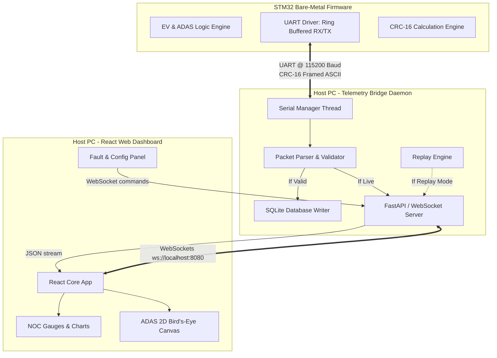
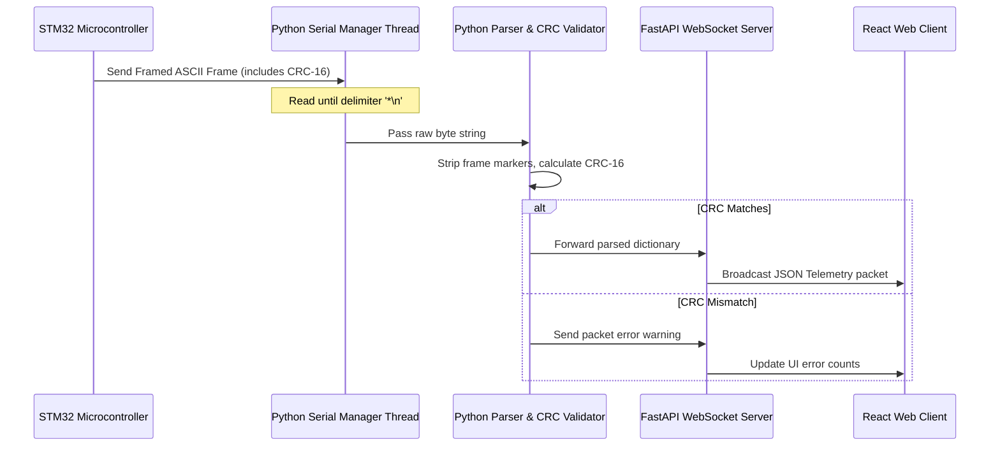
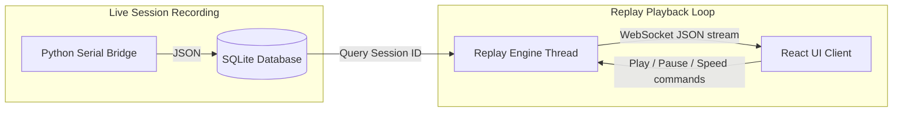
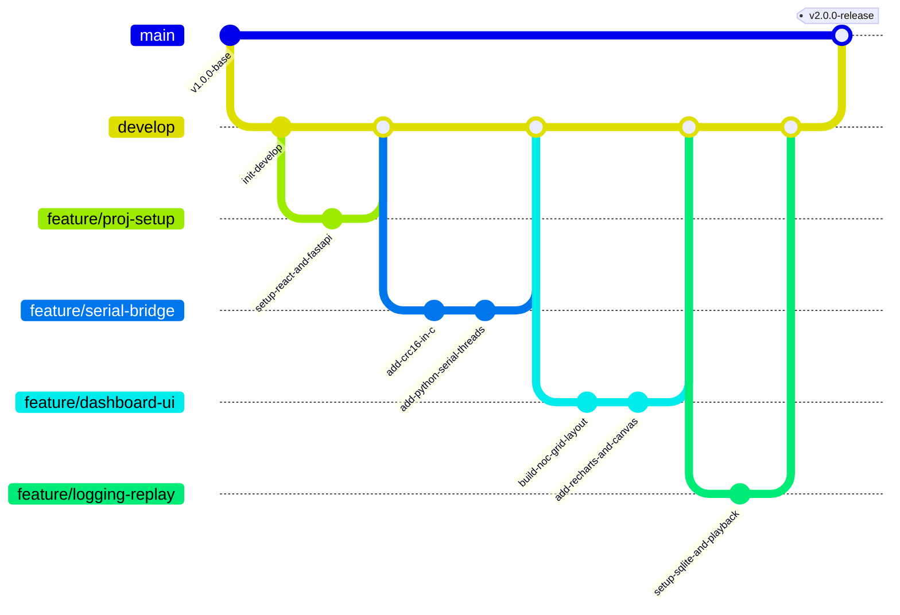
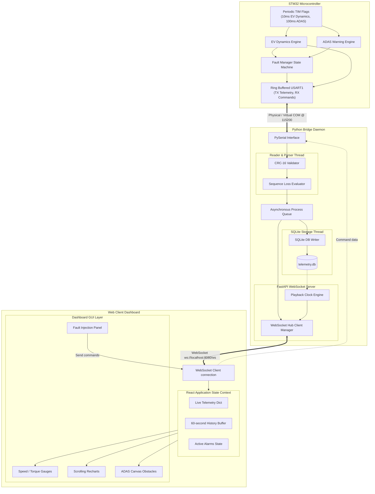

# Implementation Plan: Version 2 (Web NOC & Telemetry Protocol)

This document is the official development guide for Version 2 of the **EV ADAS Dashboard Platform**. It details the steps required to transition from the Matplotlib script to a web-based **Network Operations Center (NOC)** diagnostic cockpit, backed by a multi-threaded Python Serial-WebSocket bridge, SQLite logging, and a robust telemetry protocol with error checking.

---

## Version 2 Overview

### Goals
1.  **Eliminate UI Latency**: Replace the blocking Python Matplotlib loop with a React + Vite web dashboard operating over local WebSockets at 60+ FPS.
2.  **Ensure Data Integrity**: Implement a structured serial telemetry packet containing Sequence IDs, Millisecond Timestamps, and CRC-16 checksum validation.
3.  **Establish Data Logging**: Record all raw telemetry streams into a local SQLite database with options to export sessions as CSV.
4.  **Implement Drive Replay**: Allow engineers to load past drives from the database and stream them to the dashboard as if the vehicle were running live.
5.  **Simplify Fault Injection**: Replace command-line overrides with a visual control panel in the dashboard to inject faults and alter configurations.

### Expected Architecture

The system decouples data acquisition from visualization using a **Serial-to-WebSocket Bridge Daemon** written in Python:



### Technology Stack
*   **Microcontroller Firmware**: Embedded C, STM32 HAL, GCC, STM32CubeIDE.
*   **Host Gateway Daemon**: Python 3.10+, FastAPI (WebSocket host), PySerial (UART manager), SQLite3 (storage engine).
*   **Dashboard Frontend**: React (Vite template), JavaScript (ES6+), Tailwind CSS (layout & design), shadcn/ui (component system), Lucide React (icons), Recharts (scrolling line charts).

### Folder Structure
The workspace will be organized into clear backend, frontend, and firmware folders:
```
ev_dash/
├── ARCHITECTURE.md
├── README.md
├── ROADMAP.md
├── IMPLEMENTATION_PLAN.md      <-- [This Document]
├── Core/                       <-- [STM32 C Firmware]
│   ├── Inc/
│   └── Src/
├── telemetry_bridge/           <-- [NEW: Python Gateway Daemon]
│   ├── app/
│   │   ├── __init__.py
│   │   ├── database.py
│   │   ├── parser.py
│   │   ├── serial_mgr.py
│   │   └── uvicorn_server.py
│   ├── bridge.py               <-- [Daemon Entry Point]
│   └── requirements.txt
└── dashboard/                  <-- [NEW: React Web Application]
    ├── src/
    │   ├── components/         <-- [Dashboard Components]
    │   │   ├── AdasCanvas.jsx
    │   │   ├── AlarmCenter.jsx
    │   │   ├── FaultPanel.jsx
    │   │   ├── MetricGauge.jsx
    │   │   └── TelemetryChart.jsx
    │   ├── App.jsx
    │   ├── index.css
    │   └── main.jsx
    ├── package.json
    ├── tailwind.config.js
    └── vite.config.js
```

### Milestones
1.  **Phase 1: Project Setup** (Estimated: 5 Days)
2.  **Phase 2: Dashboard Layout & Theme** (Estimated: 5 Days)
3.  **Phase 3: Serial Bridge & Custom Protocol** (Estimated: 8 Days)
4.  **Phase 4: React Dashboard Gauges & Canvas** (Estimated: 10 Days)
5.  **Phase 5: SQLite Logging & Replay Engine** (Estimated: 6 Days)
6.  **Phase 6: Fault Injection & Parameter Config** (Estimated: 4 Days)
7.  **Phase 7: Verification & Documentation** (Estimated: 4 Days)

---

## Phase 1: Project Setup

### Objectives
Initialize the development environment for both the React frontend and the Python backend, establishing linting, directory patterns, and build files.

### Tasks
1.  Initialize the React frontend project inside the `dashboard/` directory using Vite.
2.  Install Tailwind CSS and configure `tailwind.config.js` and `postcss.config.js`.
3.  Configure shadcn/ui styles and install standard component templates.
4.  Create the `telemetry_bridge/` directory, set up a virtual environment (`venv`), and create `requirements.txt`.
5.  Develop a minimal FastAPI application that serves as a WebSocket host.

### Deliverables
*   Fully initialized frontend in `/dashboard` that builds cleanly using `npm run build`.
*   Functional Python virtual environment with FastAPI backend template running on port `8080`.

### Folder Changes
*   **Create**: `dashboard/`
*   **Create**: `telemetry_bridge/`
*   **Create**: `telemetry_bridge/app/`

### Files to Create
1.  [dashboard/vite.config.js](file:///d:/Projects/Internship/Emertxe/ev_dash/dashboard/vite.config.js): Frontend compilation configuration.
2.  [telemetry_bridge/requirements.txt](file:///d:/Projects/Internship/Emertxe/ev_dash/telemetry_bridge/requirements.txt): Python dependency checklist.
3.  [telemetry_bridge/bridge.py](file:///d:/Projects/Internship/Emertxe/ev_dash/telemetry_bridge/bridge.py): Backend daemon entry point.

### Dependencies
*   **Python**: `fastapi`, `uvicorn`, `pyserial`, `websockets`.
*   **Node.js**: `react`, `react-dom`, `lucide-react`, `tailwindcss`, `postcss`, `autoprefixer`, `clsx`, `tailwind-merge`.

### Testing Plan
*   **React**: Run `npm run dev` and ensure the welcome screen displays on `http://localhost:5173`.
*   **Python**: Run `python bridge.py` and verify Uvicorn binds to `127.0.0.1:8080`. Connect to `ws://localhost:8080/ws` using a browser extension (e.g., Simple WebSocket Client) to verify connection.

### Expected Output
A running development server where a browser client can connect over WebSockets and receive a mock connection handshake message.

### Potential Challenges
*   *CORS Issues*: React running on port 5173 may block requests to port 8080.
    *   *Mitigation*: Configure FastAPI CORSMiddleware to allow all origins during development.

### Acceptance Criteria
*   Zero compilation errors on `npm run build`.
*   FastAPI websocket connection stays open without drops during idle testing.

---

## Phase 2: Dashboard Layout & Theme

### Objectives
Design the visual structure of the dashboard, implementing the responsive grid layout, sidebar navigation, and a dark theme.

### Tasks
1.  Configure Tailwind's core color palette to use deep dark slate and automotive high-contrast accents (cyberpunk green, amber warning, hazardous red).
2.  Create a responsive dashboard shell layout with a permanent side navigation column and header status bar.
3.  Design the grid structure using Tailwind CSS Grid to host cards for gauges, charts, and system status.
4.  Implement navigation state to switch between the "Live Monitor" and "Session Replay" screens.

### Deliverables
*   Responsive React dashboard layout showing empty cards for vehicle telemetry widgets.
*   Working sidebar navigation with view switches.

### Folder Changes
*   **Create**: `dashboard/src/components/`
*   **Create**: `dashboard/src/context/`

### Files to Create
1.  `dashboard/src/components/DashboardLayout.jsx`: Master page shell containing sidebar, header, and grid contents.
2.  `dashboard/src/components/StatusHeader.jsx`: Top bar showing connection status, active errors, and timestamp.
3.  `dashboard/src/index.css`: Style sheets defining custom shadows, typography, and scrollbar modifications.

### Dependencies
*   `lucide-react` (for UI icons).

### Testing Plan
*   Open the UI in a web browser.
*   Use developer tools to scale the display size from 4K resolution down to 1080p and mobile formats to verify components wrap cleanly.
*   Verify that clicking navigation options successfully updates the main display layout.

### Expected Output
A dark-theme responsive shell that matches the Bosch/Tesla SCADA tool aesthetics, featuring navigation and a status header showing mock connection stats.

### Potential Challenges
*   *Responsive wrapping*: Dials and charts may compress and overlap on smaller displays.
    *   *Mitigation*: Force min-widths on complex widgets and adjust grid columns dynamically using Tailwind media queries (`grid-cols-1 lg:grid-cols-3`).

### Acceptance Criteria
*   The dashboard fits inside a single 1080p screen without forcing scrollbars, wrapping widgets cleanly.

---

## Phase 3: Serial Bridge & Custom Protocol

### Objectives
Upgrade the UART communication protocol with error verification (CRC-16) and build a multi-threaded Python daemon to bridge data from the virtual serial port to WebSocket clients.



### Tasks
1.  **Firmware (C)**: Write a utility module to calculate the CRC-16-CCITT checksum:
    *   Polynomial: `0x1021`, initial value: `0xFFFF`.
2.  **Firmware (C)**: Modify the transmission function in `main.c` to compile data into the structured frame:
    `$[timestamp,sequence_id,frame_type,payload...]*\n` where payload values are comma-separated and followed by the calculated CRC-16 hex value.
3.  **Python Daemon**: Develop `serial_mgr.py` utilizing a background thread to poll the virtual serial port.
4.  **Python Daemon**: Write `parser.py` to extract CSV fields, compute the local CRC-16 validation, and track packet losses via sequence jumps.
5.  **FastAPI**: Hook the parser output to the WebSocket event loop, broadcasting parsed updates as JSON.

### Deliverables
*   STM32 C code executing CRC-16 calculations on all TX telemetry packets.
*   Python Serial manager reading, parsing, validating, and forwarding packets.

### Folder Changes
*   **Modify**: `Core/Src/` and `Core/Inc/`

### Files to Create
1.  `Core/Inc/crc16.h` & `Core/Src/crc16.c`: Microcontroller CRC utility module.
2.  `telemetry_bridge/app/serial_mgr.py`: Threaded serial port interface.
3.  `telemetry_bridge/app/parser.py`: Telemetry and command packet parsing and validation algorithms.

### Dependencies
*   `pyserial` for accessing COM ports.

### Testing Plan
*   Compile and load firmware. Connect the virtual serial COM port to a terminal application to inspect raw frame structure:
    `$[102450,154,D,42.5,95.0,20,25.4,300,10,0,E54F]*`
*   Run the Python bridge and intentionally inject corrupted frames (e.g. modify checksum strings) to ensure the daemon identifies and drops them, updating CRC error statistics.

### Expected Output
A stream of validated telemetry records printed in the daemon log and broadcasted over WebSockets at 10 Hz without buffer overflows.

### Potential Challenges
*   *Serial Port Contention*: Python may crash if the port is busy or disconnected.
    *   *Mitigation*: Wrap serial port queries in `try-except` blocks. If a read fails, release the port, wait 2 seconds, and attempt a reconnect loop.

### Acceptance Criteria
*   The parser catches 100% of corrupted packets (any byte modified).
*   No sequence mismatch faults occur under normal operating conditions.

---

## Phase 4: React Dashboard Components

### Objectives
Build the visual widgets of the dashboard, showing live speedometers, trend graphs, an interactive bird's-eye view canvas, and error log panels.

### Tasks
1.  Create the **MetricGauge** component utilizing SVG to render a semi-circular speedometer and torque meter with glowing accent rings.
2.  Develop the **AdasCanvas** component using HTML5 Canvas to render the bird's-eye view, placing the ego vehicle in the center and drawing obstacle boxes whose distance scales with range values.
3.  Create the **TelemetryChart** component using Recharts to display a real-time scrolling history of speed and battery temperature.
4.  Build the **AlarmCenter** widget to display warning boxes (flashing red for collisions, yellow for over-temperature).
5.  Create the **PacketInspector** drawer showing a raw view of the incoming serial frames alongside packet statistics (latency, CRC error rate).

### Deliverables
*   Functional dashboard interface displaying dynamic gauges, scrolling charts, and an interactive ADAS obstacle view.

### Files to Create
1.  `dashboard/src/components/MetricGauge.jsx`: Custom SVG semi-circular gauge.
2.  `dashboard/src/components/AdasCanvas.jsx`: HTML5 Canvas obstacle positioning grid.
3.  `dashboard/src/components/TelemetryChart.jsx`: Recharts component for rolling line charts.
4.  `dashboard/src/components/PacketInspector.jsx`: UI widget showing raw strings and statistics.

### Dependencies
*   `recharts` for charts.

### Testing Plan
*   Run the Python daemon in **Demo Mode** (generating simulated vehicle dynamics telemetry).
*   Open the React dashboard and verify that gauges track speed updates smoothly and the line charts scroll without performance degradation.
*   Simulate close obstacles and verify that the canvas draws warning cones and the background flashes red during critical alarms.

### Expected Output
A dark cockpit interface animating at 60 FPS, with scrolling line charts and a canvas rendering dynamic sensor range targets.

### Potential Challenges
*   *Performance issues*: Frequent state updates (10Hz) can cause React to lag.
    *   *Mitigation*: Debounce chart updates, or use refs/uncontrolled canvas operations for the ADAS visualization.

### Acceptance Criteria
*   CPU usage remains below 10% on a standard desktop browser while rendering the dashboard.
*   Live charts display at least a 60-second scrolling window of speed history.

---

## Phase 5: Telemetry Logger & Replay Engine

### Objectives
Implement local data storage for telemetry using SQLite and build a replay engine to review past driving sessions on the dashboard.



### Tasks
1.  **Backend**: Set up an SQLite3 database with tables for sessions and telemetry records.
2.  **Backend**: Write database storage routines inside the parser module to save every valid incoming telemetry frame.
3.  **Backend**: Expose an API endpoint (`/sessions`) to list recorded sessions and another (`/sessions/{id}/export`) to export data as CSV.
4.  **Replay Engine**: Build a playback class in Python that reads session rows and streams them to connected WebSockets at the original rate, responding to commands (play, pause, seek, speed).
5.  **Frontend**: Create the Replay UI pane with playback controls, timeline sliders, and a session selector dropdown.

### Deliverables
*   SQLite database recording all telemetry.
*   Replay manager enabling session selection and interactive playback.

### Files to Create
1.  `telemetry_bridge/app/database.py`: SQLite schemas, tables, and CRUD operations.
2.  `telemetry_bridge/app/replay_mgr.py`: Playback timing loop and controller.
3.  `dashboard/src/components/ReplayController.jsx`: UI bar containing play, pause, progress bar, and speed options.

### Dependencies
*   `sqlite3` (built-in Python library).

### Testing Plan
*   Run a 2-minute simulated drive. Check that `telemetry.db` is populated with records.
*   Use the dashboard UI to export the session to CSV and open the file to verify all columns (Speed, SOC, Temp, etc.) are present.
*   Load the recorded session, play it back on the dashboard, and verify that the gauges and charts replicate the original run.

### Expected Output
A database logging telemetry at 10Hz, with a frontend interface allowing users to replay sessions with timeline scrubbing and playback speed controls.

### Potential Challenges
*   *Database Write Overhead*: Frequent database writes can block the serial reader.
    *   *Mitigation*: Use a separate worker queue for database writes, or insert telemetry records in batches (e.g. every 10 frames).

### Acceptance Criteria
*   Exported CSV files can be parsed cleanly by Microsoft Excel or Python Pandas.
*   Replay playback timing matches the original rate within a margin of +/-50ms.

---

## Phase 6: Fault Injection & Parameter Configuration

### Objectives
Build the bidirectional control interface, enabling engineers to inject vehicle faults and adjust system configurations directly from the dashboard.

### Tasks
1.  **Frontend**: Create a control panel component with toggle buttons for each fault type (Overheat, Low SOC, Critical Collision, Sensor Failure, Timeout).
2.  **Frontend**: Develop input fields to view and update ADAS thresholds (e.g., collision warning distance, temp limit).
3.  **Backend**: Implement API endpoints or WebSocket routes to receive these requests, validate formatting, and serialize them into command packets.
4.  **Firmware (C)**: Modify the UART RX parser in `uart_shell.c` to parse the new command frame format:
    `$[timestamp,seq,C,CMD_TYPE,VALUE,CRC]*\n`
    Verify the checksum and execute the target command (e.g. override sensor range, force safe state).

### Deliverables
*   Fault injection panel in the web interface.
*   Bidirectional serial commands with CRC validation.
*   C firmware modules executing commands and returning status logs.

### Files to Create
1.  `dashboard/src/components/FaultPanel.jsx`: Layout containing injection buttons and threshold input fields.
2.  `Core/Src/uart_shell.c` (Modified): Upgraded parser validating CRC check before running command routines.

### Testing Plan
*   With the system running, click **Inject Overheat** on the React dashboard. Verify the status updates:
    *   `LED_FAULT_PIN` (PB11) on the microcontroller turns HIGH.
    *   Vehicle transitions to `STATE_FAULT`.
    *   The React Dashboard status indicator flashes `FAULT ACTIVE (OVER-TEMPERATURE)`.
*   Alter the collision warning distance to `80cm` in the dashboard settings. Verify the change in the terminal logs and test that warning states trigger at the new distance.

### Expected Output
A settings panel in the browser to control simulated vehicle hazards and parameters in real time over serial connection.

### Potential Challenges
*   *Race conditions*: If serial commands are sent at the same time as telemetry frames, the line can get blocked.
    *   *Mitigation*: Implement a mutex or queue in the Python gateway to ensure command transmissions do not clash with telemetry reads.

### Acceptance Criteria
*   Commands are parsed and executed by the STM32 within 100ms of clicking a dashboard button.
*   Invalid commands (with corrupt CRC check) are dropped by the STM32 and logged in the error console.

---

## Phase 7: Verification & Documentation

### Objectives
Perform system-level testing of the integrated Version 2 platform, compile documentation, and prepare the project for production packaging.

### Tasks
1.  Examine memory usage, loop timing, and packet drop rates under long-duration stress tests.
2.  Compile API specifications detailing the serial frame formats and WebSocket payloads.
3.  Draft setup instructions detailing port configurations and dependencies.
4.  Capture screenshots and record demonstrations of the running dashboard, alarm states, and replay modes.

### Deliverables
*   Final Version 2 documentation updates.
*   Tested code repositories.

### Files to Create
1.  `telemetry_bridge/README.md`: Gateway installation and script execution procedures.
2.  `dashboard/README.md`: React client deployment guides.

### Testing Plan
*   Execute a 12-hour continuous connection run with the STM32 streaming to the React dashboard.
*   Monitor system logs to verify:
    *   Microcontroller stack/heap usage is stable.
    *   Python process memory is stable.
    *   No thread locks or unhandled serial timeouts occurred.

### Expected Output
A fully documented project with setup guides and clean, commented code files ready for publication.

### Potential Challenges
*   *Windows port mapping*: Port names (e.g., `COM3`) change depending on USB ports.
    *   *Mitigation*: Write auto-detection logic in the Python bridge to scan active ports and select matching converters.

### Acceptance Criteria
*   The platform runs for 12 hours straight without packet crashes or system freezes.
*   Documentation outlines every configuration parameter clearly.

---

## Overall Folder Hierarchy

The final version of the Version 2 directory tree is structured as follows:

```
ev_dash/
├── ARCHITECTURE.md
├── README.md
├── ROADMAP.md
├── IMPLEMENTATION_PLAN.md
├── ev_dash.ioc
├── STM32F103C8TX_FLASH.ld
├── Core/
│   ├── Inc/
│   │   ├── adas.h
│   │   ├── common.h
│   │   ├── crc16.h             <-- [NEW: CRC-16 Header]
│   │   ├── ev_control.h
│   │   ├── fault.h
│   │   ├── main.h
│   │   ├── uart_shell.h
│   │   └── ultrasonic.h
│   └── Src/
│       ├── adas.c
│       ├── crc16.c             <-- [NEW: CRC-16 Source]
│       ├── ev_control.c
│       ├── fault.c
│       ├── main.c
│       ├── uart_shell.c
│       └── ultrasonic.c
├── telemetry_bridge/
│   ├── app/
│   │   ├── __init__.py
│   │   ├── database.py         <-- [NEW: SQLite DB Handler]
│   │   ├── parser.py           <-- [NEW: Telemetry Frame Parser]
│   │   ├── replay_mgr.py       <-- [NEW: Playback Controller]
│   │   ├── serial_mgr.py       <-- [NEW: UART Connection Manager]
│   │   └── uvicorn_server.py   <-- [NEW: FastAPI WebSockets Server]
│   ├── bridge.py
│   └── requirements.txt
└── dashboard/
    ├── public/
    ├── src/
    │   ├── assets/
    │   ├── components/
    │   │   ├── AdasCanvas.jsx  <-- [NEW: ADAS Radar Panel]
    │   │   ├── AlarmCenter.jsx <-- [NEW: Alerts Display]
    │   │   ├── DashboardLayout.jsx
    │   │   ├── FaultPanel.jsx  <-- [NEW: Controls Panel]
    │   │   ├── MetricGauge.jsx <-- [NEW: Dials Display]
    │   │   ├── PacketInspector.jsx
    │   │   ├── ReplayController.jsx
    │   │   ├── StatusHeader.jsx
    │   │   └── TelemetryChart.jsx
    │   ├── App.jsx
    │   ├── index.css
    │   └── main.jsx
    ├── index.html
    ├── package.json
    ├── tailwind.config.js
    └── vite.config.js
```

---

## Git Branching Strategy

A Git Flow branching model is recommended to manage development stages cleanly:



### Development Rules
*   **Branch Names**:
    *   `feature/phase1-setup` for environment configurations.
    *   `feature/phase3-serial-protocol` for the C/Python serial bridge.
    *   `feature/phase4-react-components` for the React dashboard frontend.
    *   `feature/phase5-logging-replay` for database support.
    *   `feature/phase6-fault-inject` for command pipelines.
*   **Merge Policy**: All feature merges to `develop` must require a successful build test and verification of the serial packet validation.

---

## Recommended Commit Plan

To build a professional git history, organize commits by functionality using standardized prefixes:

1.  `feat(setup): initialize React-Vite dashboard and FastAPI bridge environment`
2.  `style(ui): create dark-theme layout with sidebar navigation`
3.  `feat(firmware): implement CRC-16 CCITT module and update UART TX payload format`
4.  `feat(bridge): implement serial reader thread with error-handling reconnect loops`
5.  `feat(parser): add ASCII packet framer and sequence loss check algorithms`
6.  `feat(ui): build MetricGauge and scrollable TelemetryChart components`
7.  `feat(ui): implement AdasCanvas for bird's-eye obstacle visualizations`
8.  `feat(db): implement SQLite telemetry logger and export-to-CSV methods`
9.  `feat(replay): build session playback timing loops in bridge backend`
10. `feat(ui): create ReplayController progress interface`
11. `feat(firmware): integrate CRC checks on incoming UART RX commands`
12. `feat(ui): implement FaultPanel component for parameter injection`
13. `docs(readme): draft setup scripts, api routes, and telemetry schemas`

---

## Risk Analysis & Mitigations

### 1. High-Rate UI Lag
*   **Risk**: React components re-rendering at 10Hz can lock the browser thread, causing chart jitters.
*   **Mitigation**: Use Recharts properties like `isAnimationActive={false}` for live data to reduce GPU overhead. Debounce UI states if needed.

### 2. SQLite Write Bottlenecks
*   **Risk**: Synchronous SQLite writes at 10Hz can block the serial reader thread, leading to dropped buffer packets.
*   **Mitigation**: Configure SQLite using Write-Ahead Logging (`PRAGMA journal_mode=WAL;`). Use a Python queue to handle database writes asynchronously on a separate thread.

### 3. Serial Port Disconnection
*   **Risk**: Unplugging the serial adapter crashes the daemon.
*   **Mitigation**: Implement a try-except structure in the serial reader task that releases the port, runs a sleep timer, scans ports, and attempts to reconnect.

### 4. Packet Collisions
*   **Risk**: Telemetry TX from the STM32 colliding with RX fault commands.
*   **Mitigation**: Rely on hardware-level full-duplex UART configurations. Use non-blocking ring-buffered interrupt routines for RX characters on the microcontroller.

---

## Final Version 2 Architecture

The data pathways, processes, and network boundaries of Version 2 are configured as follows:


