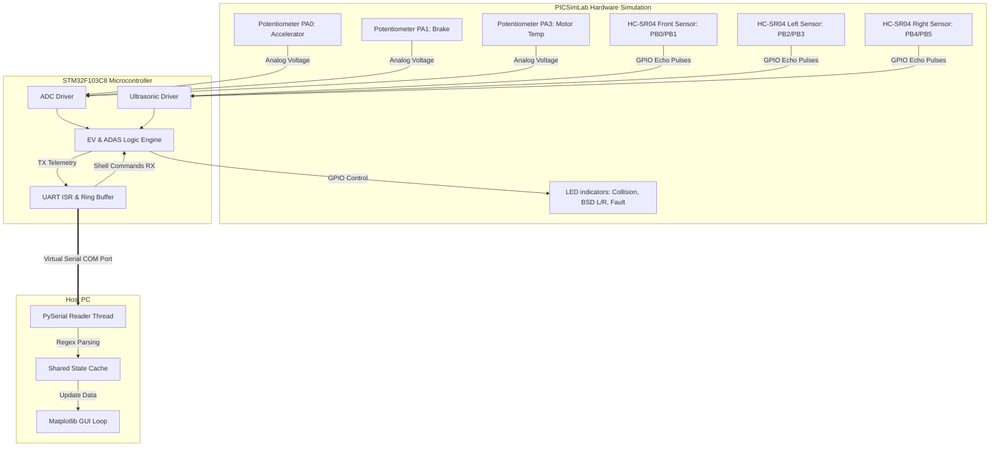
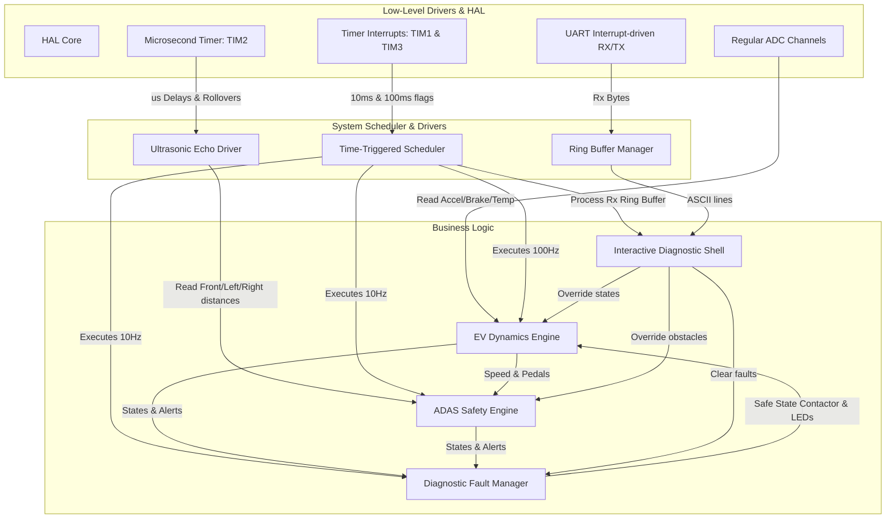
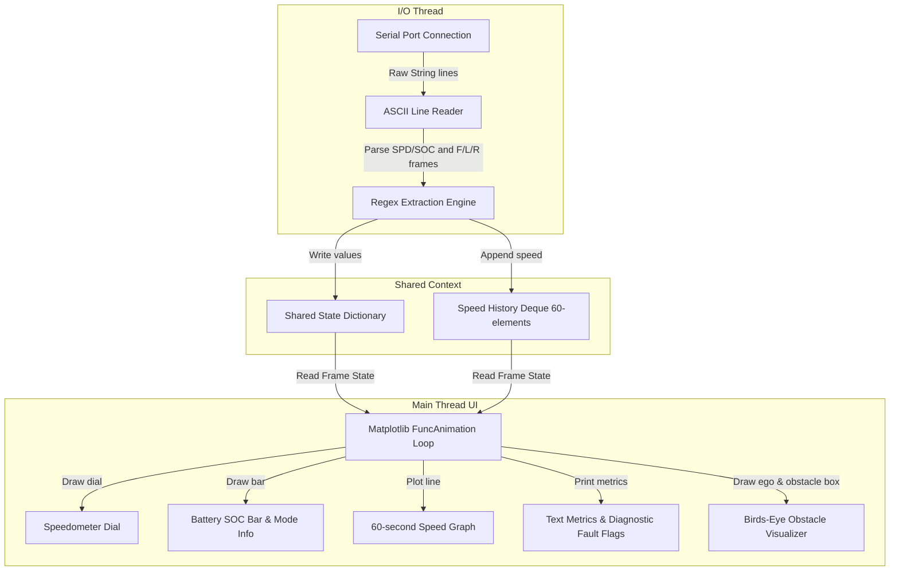
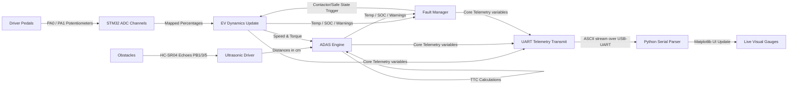
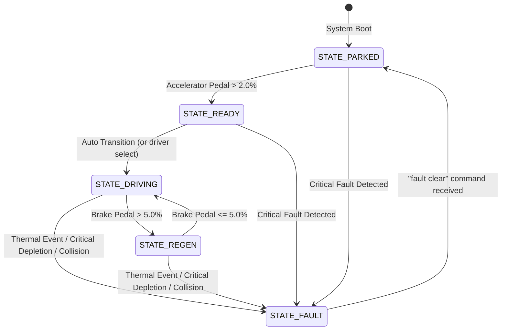

# EV ADAS Dashboard

[](https://www.st.com/en/microcontrollers-microprocessors/stm32f103c8.html)
[](https://www.st.com/en/embedded-software/stm32cube-mcu-mpu-packages.html)
[](https://lcgamboa.github.io/picsimlab/)
[](https://matplotlib.org/)
[](LICENSE)

A complete hardware-in-the-loop (HIL) style simulation of an Electric Vehicle (EV) Dashboard integrated with Advanced Driver Assistance Systems (ADAS). The project features a modular STM32 firmware stack executing on an ARM Cortex-M3 (Blue Pill) that calculates vehicle dynamics, manages safety-critical ADAS alerts, monitors system faults, and streams real-time telemetry over UART to a custom Python GUI dashboard.

---

## Table of Contents

- [Project Overview](#project-overview)
- [Problem Statement](#problem-statement)
- [Key Features](#key-features)
- [Technology Stack](#technology-stack)
- [System Architecture](#system-architecture)
- [Firmware Architecture](#firmware-architecture)
- [Python Dashboard Architecture](#python-dashboard-architecture)
- [Complete Data Flow](#complete-data-flow)
- [Project Workflow](#project-workflow)
- [Hardware & Pin Mapping](#hardware--pin-mapping)
- [Software Prerequisites](#software-prerequisites)
- [Project Structure](#project-structure)
- [Core Functionalities](#core-functionalities)
  - [Vehicle Dynamics Engine](#vehicle-dynamics-engine)
  - [ADAS Alert System](#adas-alert-system)
  - [Fault Diagnosis & Safe State](#fault-diagnosis--safe-state)
  - [UART Diagnostic Shell](#uart-diagnostic-shell)
- [Vehicle State Machine](#vehicle-state-machine)
- [Telemetry Protocol](#telemetry-protocol)
- [How to Build & Run](#how-to-build--run)
- [Future Improvements](#future-improvements)
- [Learning Outcomes](#learning-outcomes)
- [Acknowledgements](#acknowledgements)

---

## Project Overview

This repository demonstrates a virtualized, local implementation of a modern EV control unit and instrument cluster dashboard. Rather than relying on physical vehicle hardware, the project uses the **PICSimLab** simulator to run STM32 firmware that reads analog sensor inputs (simulated via potentiometers) and ultrasonic sensor echo signals. 

The STM32 firmware calculates core traction metrics—such as speed, motor torque, instantaneous power, battery State-of-Charge (SOC), and estimated range—while simultaneously processing raw echoes from three simulated HC-SR04 sensors. This data is checked against collision, blind-spot, and parking thresholds, and streamed over a virtual COM port (115200 baud UART) to a live Python dashboard built with Matplotlib.

```
       +-----------------------+              +------------------------+
       |   STM32 Firmware      |   UART/USB   |   Matplotlib Dashboard |
       | (EV Control & ADAS)   | ------------>| (Real-time telemetry,  |
       |  Running in Simulator | <------------|  Visual alerts & logs) |
       +-----------------------+  Shell CMDs  +------------------------+
```

---

## Problem Statement

Developing firmware for electric vehicles and ADAS algorithms typically requires expensive test rigs, CAN bus interfaces, and physical sensor mockups. In educational and prototype environments, this creates a high barrier to entry. 

This project addresses this issue by providing a complete, localized development and simulation environment. By combining an ARM Cortex-M3 microcontroller emulation (Blue Pill) with PICSimLab, firmware engineers can develop, debug, and verify safety-critical algorithms (such as Time-to-Collision calculations, sensor hysteresis filtering, and fault-induced safe state entries) without using physical vehicle platforms.

---

## Key Features

- **Real-Time EV Dynamics**: Evaluates motor torque, speed (Euler integration of mass and drag), power consumption, battery SOC, and remaining range.
- **Integrated ADAS Suite**: 
  - *Forward Collision Warning (FCW)* based on raw distance and calculated Time-To-Collision (TTC).
  - *Blind Spot Detection (BSD)* mapped to left and right sensors with speed gates.
  - *Parking Assist* with proximity alarms.
- **Safety-Critical Fault Manager**: Monitors motor temperature, critical battery depletion, and collision hazards to trip a virtual contactor and transition the vehicle into a **Safe State**.
- **Interactive UART Shell**: A ring-buffered diagnostic shell allowing developers to inject faults, override speed/SOC metrics, set drive modes (ECO/NORMAL/SPORT), and clear latched faults.
- **Multitasking Scheduler**: A time-triggered scheduler executing modules at 10ms (100Hz) and 100ms (10Hz) frequencies using hardware timers.
- **Live GUI Dashboard**: Multi-pane Python window featuring circular gauges, history trend plots, and an interactive bird's-eye view showing surrounding obstacles.

---

## Technology Stack

| Component | Technology | Role |
|---|---|---|
| **Core Microcontroller** | STM32F103C8T6 (Blue Pill) | Main controller executing dynamics, ADAS, and diagnostics. |
| **Firmware Framework** | STM32 HAL (Hardware Abstraction Layer) | Pin configuration, ADC conversions, UART communication, and Timers. |
| **Development IDE** | STM32CubeIDE / GCC compiler | Code development, static analysis, and binary compilation. |
| **Hardware Simulator** | PICSimLab (Board: GPBoard/STM32) | Microcontroller, sensor, potentiometer, and LED emulator. |
| **Serial Bus** | UART / USART1 (115200, 8N1) | Microcontroller-to-PC telemetry stream and diagnostic RX shell. |
| **Dashboard Front-End**| Python 3 (Matplotlib, PySerial) | Telemetry parsing, live gauge rendering, and graphic UI thread. |

---

## System Architecture



---

## Firmware Architecture



---

## Python Dashboard Architecture



---

## Complete Data Flow



---

## Project Workflow

The following sequence describes the system's start-to-finish execution:

1. **System Initialization**:
   - The STM32 boots up, configures system clocks to 72 MHz, and initializes GPIO, ADC, Timers (TIM1, TIM2, TIM3, TIM4), and USART1.
   - Core handles (`ev`, `adas`, `flt`) are configured to default variables (vehicle is in `STATE_PARKED`, battery is initialized to 100% SOC).
   - Interrupts are enabled for TIM1 (10ms period base), TIM3 (100ms period base), and UART RX (single-byte circular buffering).
2. **Foreground Executive Loop (Cooperative Scheduling)**:
   - **Every 10ms (TIM1 Tick)**: Microcontroller scans the ADC channels (Accelerator pedal, Brake pedal, and Motor Temperature) and updates vehicle speed and battery SOC.
   - **Every 100ms (TIM3 Tick)**: Firmware triggers and reads the front, left, and right ultrasonic sensors sequentially, updates ADAS warnings (TTC/Blind spots), checks for diagnostic faults, and executes the interactive UART shell.
3. **Telemetry Streaming**:
   - Every 1000ms (10 ticks of the EV loop), the system compiles two diagnostic ASCII frames detailing vehicle dynamics and ADAS states, and transmits them over UART.
4. **Dashboard Ingestion & UI Loop**:
   - The Python script reads the virtual COM port asynchronously.
   - Incoming lines are evaluated using regular expressions. Parsed telemetry is written to a shared state dictionary.
   - Every 100ms, Matplotlib refreshes the UI frame, displaying dials, historical speed curves, and warning flags.

---

## Hardware & Pin Mapping

The physical microcontroller configuration uses the standard STM32 Blue Pill layout:

| Pin | Function | Peripheral | Simulated Device | Direction |
|---|---|---|---|---|
| **PA0** | Accelerator Input | ADC1_CH0 | Potentiometer | Input (Analog) |
| **PA1** | Brake Input | ADC1_CH1 | Potentiometer | Input (Analog) |
| **PA3** | Motor Temperature | ADC1_CH3 | Potentiometer | Input (Analog) |
| **PB0** | Trig: Front Sensor | GPIO | HC-SR04 Front Trig | Output (Digital) |
| **PB1** | Echo: Front Sensor | GPIO | HC-SR04 Front Echo | Input (Digital) |
| **PB2** | Trig: Left Sensor | GPIO | HC-SR04 Left Trig | Output (Digital) |
| **PB3** | Echo: Left Sensor | GPIO | HC-SR04 Left Echo | Input (Digital) |
| **PB4** | Trig: Right Sensor | GPIO | HC-SR04 Right Trig | Output (Digital) |
| **PB5** | Echo: Right Sensor | GPIO | HC-SR04 Right Echo | Input (Digital) |
| **PA9** | USART1 TX | USART1 | UART-to-USB Bridge | Output (Serial) |
| **PA10**| USART1 RX | USART1 | UART-to-USB Bridge | Input (Serial) |
| **PB8** | Collision Alert LED| GPIO | Red Warning LED | Output (Digital) |
| **PB9** | BSD Left Warning LED| GPIO | Amber LED | Output (Digital) |
| **PB10**| BSD Right Warning LED| GPIO | Amber LED | Output (Digital) |
| **PB11**| Contactor / Fault LED| GPIO | System Contactor LED | Output (Digital) |

---

## Software Prerequisites

To run this simulation, install the following software packages:

- **STM32CubeIDE**: Recommended IDE for compiling and flashing the STM32F103C8T6 firmware.
- **PICSimLab (version 0.9.0 or higher)**: Used to load the compiled microcontroller hex/bin and run the virtual hardware layout.
- **Virtual Serial Port Emulator**: Required to bridge UART signals between PICSimLab and the Python Dashboard.
  - *Windows*: Use **com0com** or **VSPE** to create a linked COM pair (e.g., `COM3 <-> COM4`).
  - *Linux/macOS*: Use `socat` commands: `socat -d -d pty,raw,echo=0 pty,raw,echo=0`.
- **Python 3.8+**: With dependencies installed:
  ```bash
  pip install pyserial matplotlib numpy
  ```

---

## Project Structure

```
.
├── ARCHITECTURE.md            # In-depth technical module & engine analysis
├── Core
│   ├── Inc
│   │   ├── adas.h             # Alert levels, warning thresholds, ADAS handles
│   │   ├── common.h           # Share definitions, pin aliases, and drive mode structures
│   │   ├── ev_control.h       # EV parameters, physical constants, model handles
│   │   ├── fault.h            # Diagnostic fault registers and recovery contracts
│   │   ├── main.h             # Core STM32 hardware declarations
│   │   ├── uart_shell.h       # Ring buffer structures and CLI functions
│   │   └── ultrasonic.h       # Ultrasonic driver interface config
│   └── Src
│       ├── adas.c             # TTC calculation, blind-spot logic, and hysteresis
│       ├── ev_control.c       # Mathematical vehicle physics & SOC integration
│       ├── fault.c            # Fault checking, safe-state latching, and reset logic
│       ├── main.c             # Multi-rate scheduler executive and timer configurations
│       ├── uart_shell.c       # Ring-buffered CLI shell parsing and commands
│       └── ultrasonic.c       # microsecond timer pulse timing for HC-SR04
├── Drivers                    # STM32 CMSIS and HAL standard libraries
├── ev_dashboard.py            # Live Matplotlib cockpit visualization
├── ev_dash.ioc                # STM32CubeMX graphical configuration project
└── README.md                  # Main landing page documentation
```

---

## Core Functionalities

### Vehicle Dynamics Engine
The dynamics module ([ev_control.c](Core/Src/ev_control.c)) emulates the mechanical and electrical behavior of an EV traction drive:
- **Torque Mapping**: Converts the accelerator position and drive mode (ECO, NORMAL, SPORT) to a requested torque value:
  $$\text{Torque} = \left(\frac{\text{Pedal}\%}{100}\right) \times \text{MaxTorque} \times \text{ModeScale}$$
- **Euler Integration for Speed**: Integrates torque and speed-dependent drag forces at a 100 Hz update rate:
  $$v_{t} = v_{t-1} + \frac{T_e - C_d \cdot v_{ms}}{\text{VehicleMass}} \cdot \Delta t$$
- **SOC Integration**: Uses energy depletion metrics, tracking mechanical power and copper losses ($I^2R$) to update battery charge status.
- **Range Estimation**: Predicts range by dividing remaining battery capacity by drive mode efficiency.

### ADAS Alert System
The ADAS system ([adas.c](Core/Src/adas.c)) processes ultrasonic distances to prevent collisions:
- **Time-To-Collision (TTC)**: Calculated dynamically using relative approach velocity:
  $$\text{TTC} = \frac{\text{Distance (m)}}{\text{Relative Speed (m/s)}}$$
- **Sensor Hysteresis**: Filters noise and jitter by requiring multiple consecutive cycles of warning clearance before clearing active alarms:
  ```
  [Obstacle Detected] ──> Set Warning Level 1/2/3 ──> Reset Hysteresis counter
  [Obstacle Cleared]  ──> Count down hysteresis loops ──> Clear warnings only at 0
  ```

### Fault Diagnosis & Safe State
The Fault module ([fault.c](Core/Src/fault.c)) monitors safety thresholds. If a critical fault condition occurs:
- A bitwise flag is set in the fault register (`FAULT_OT`, `FAULT_SOC`, or `FAULT_COL`).
- The vehicle transitions immediately to **STATE_FAULT**.
- An emergency safety contactor is tripped (represented by `PB11` outputting high).
- Drive torque is zeroed to bring the vehicle to a safe halt.
- *Recovery*: Faults must be cleared via the UART Shell (`fault clear` command), resetting the state machine back to `STATE_PARKED`.

### UART Diagnostic Shell
The diagnostic shell ([uart_shell.c](Core/Src/uart_shell.c)) uses a ring buffer to parse commands character-by-character. Commands include:
- `mode <eco|normal|sport>`: Changes drive characteristics.
- `speed set <kmh>` / `soc set <pct>` / `temp set <degC>`: Injects test parameters.
- `obstacle <cm>`: Simulates a front obstacle for safety validation.
- `obstacle clear`: Recovers the front sensor readings to default values.
- `fault inject <motor|soc|col>`: Simulates diagnostic faults.
- `fault clear`: Recovers from a latched safety shutdown.
- `status`: Outputs complete text diagnostic logs.

---

## Vehicle State Machine

The vehicle's operational state is governed by a state machine that controls transition logic:



---

## Telemetry Protocol

Telemetry is streamed over UART continuously at 1.0 Hz in two text frames.

### Frame 1: Vehicle Dynamics
```
SPD:72.5 SOC:79.3 TRQ:75 TMP:27.1 RNG:260 ACC:50 BRK:0\r\n
```
| Tag | Parameter | Units | Format | Example |
|---|---|---|---|---|
| **SPD** | Vehicle Speed | km/h | `float` (1 decimal) | 72.5 |
| **SOC** | State of Charge | % | `float` (1 decimal) | 79.3 |
| **TRQ** | Motor Torque | Nm | `int` | 75 |
| **TMP** | Motor Temperature| °C | `float` (1 decimal) | 27.1 |
| **RNG** | Estimated Range | km | `int` | 260 |
| **ACC** | Accelerator Pedal | % | `int` | 50 |
| **BRK** | Brake Pedal | % | `int` | 0 |

### Frame 2: ADAS & Diagnostics
```
F:40 L:400 R:400 TTC:2.1s COL:1 BSD:00 ALM:2 FLT:04\r\n
```
| Tag | Parameter | Units | Format | Example |
|---|---|---|---|---|
| **F** | Front Obstacle | cm | `int` | 40 |
| **L** | Left Obstacle | cm | `int` | 400 |
| **R** | Right Obstacle | cm | `int` | 400 |
| **TTC** | Time-To-Collision | seconds | `float` (1 decimal) | 2.1 |
| **COL** | Collision Warn Level| - | `int` (0=None, 1=Warn, 2=Crit) | 1 |
| **BSD** | Blind Spot Left/Right| - | `binary string` (e.g., `00` or `10`) | 00 |
| **ALM** | Alarm Level Priority| - | `int` (0=None, 1=Adv, 2=Wrn, 3=Crt) | 2 |
| **FLT** | Fault Bitmask Register| - | `hexadecimal` (OT=01, SOC=02, COL=04) | 04 |

---

## Dashboard Preview

Below is a placeholder for the graphical dashboard output. The dynamic cockpit features multi-gauge rendering and a real-time ADAS birds-eye map:

```
+--------------------------------------------------------------+
|                    EV ADAS SYSTEM MONITOR                    |
+------------------------------+-------------------------------+
|                              |                               |
|        SPEED (km/h)          |         BATTERY SOC           |
|            /---\             |       [======    ] 65.4%      |
|           /  *  \            |                               |
|          |   |   |           |         DRIVE MODE:           |
|           \     /            |           NORMAL              |
|            \___/             |                               |
|             120              |       EST RANGE: 280 km       |
|                              |                               |
+------------------------------+-------------------------------+
|                              |                               |
|       SPEED TREND (60s)      |     ADAS BIRD-EYE VIEW        |
|  200|                        |             |  |              |
|     |  _.-'-._               |        [Front: 40cm]          |
|  100| /       \__            |             |  |              |
|     |/           \           |       +-----+--+-----+        |
|    0+-------------           |       |     |  |     |        |
|      0          60s          |       |     |EV|     |        |
|                              |       +-----+--+-----+        |
+------------------------------+-------------------------------+
```

---

## How to Build & Run

### Step 1: Compile Firmware
1. Open **STM32CubeIDE**.
2. Import this project workspace directory.
3. Select **Clean and Build** (configured for ARM GCC compiler).
4. Verify that a `.hex` and `.elf` binary are generated in the `Debug/` folder.

### Step 2: Set Up Virtual COM Loopback
Configure a virtual serial bridge to allow communication between PICSimLab and Python. For example, on Windows using com0com, create a virtual COM pair:
- Device 1: `COM3` (Connects to PICSimLab)
- Device 2: `COM4` (Connects to Python Dashboard)

### Step 3: Configure and Load PICSimLab
1. Open **PICSimLab**.
2. Select Board: **GPBoard (STM32)** or configure it to run `STM32F103C8T6`.
3. Go to **File -> Load Hex** and select the `.hex` file compiled in Step 1.
4. Under **Configure -> Serial**, select `COM3` as the target virtual port.
5. In PICSimLab, attach potentiometers to pins `PA0`, `PA1`, and `PA3` to control the accelerator, brake, and temperature. Attach ultrasonic sensor models to pins `PB0/1`, `PB2/3`, and `PB4/5`.

### Step 4: Launch Python GUI Dashboard
1. Open a terminal on your host PC and navigate to the project directory.
2. Run the dashboard script, pointing it to the second port of the virtual COM pair:
   ```bash
   python ev_dashboard.py --port COM4
   ```
3. To test the GUI without simulator hardware, run the script in **Demo Mode**:
   ```bash
   python ev_dashboard.py --demo
   ```

---

## Future Improvements

- **CAN Bus Integration**: Migrate telemetry streaming from point-to-point UART to a multi-node controller area network (CAN 2.0B) using CAN frames.
- **FreeRTOS Migration**: Replace the simple time-triggered scheduler with a real-time operating system (FreeRTOS) to support preemptive multitasking.
- **DMA Enhancements**: Configure DMA streams for UART transmission and multi-channel ADC scanning to reduce CPU overhead.
- **Physical Sensor Testing**: Validate firmware on physical hardware using three HC-SR04 sensors and an actual STM32 Blue Pill development board.
- **Diagnostics Logging**: Implement an SD-card log module or internet gateway to store driving data on a remote server.

---

## Learning Outcomes

- **Embedded Systems Design**: Gained hands-on experience developing modular code on STM32 microcontrollers using the STM32 HAL library.
- **Automotive State Machines**: Implemented state machines to manage driving modes, regenerative braking transitions, and safety shutdowns.
- **Time-Triggered Architectures**: Designed a cooperative scheduler using timer interrupts to run tasks at different update rates.
- **Sensor Data Filtering**: Developed algorithms to calculate Time-to-Collision (TTC) and implemented hysteresis filters to remove noise from raw sensor inputs.
- **HIL Testing and Simulation**: Used PICSimLab and Python scripts to run simulated hardware-in-the-loop tests.

---

## Acknowledgements

- **Emertxe Information Technologies** for providing the curriculum and project guidelines for the embedded systems internship.

