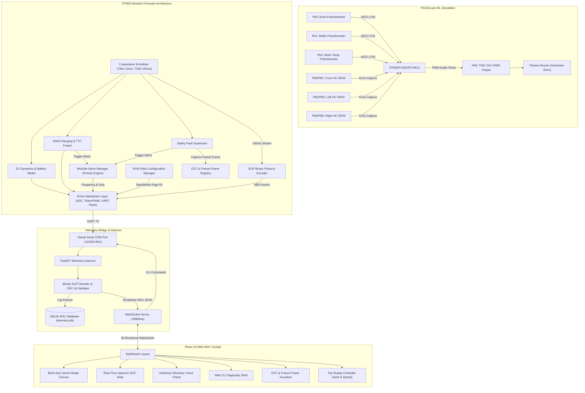
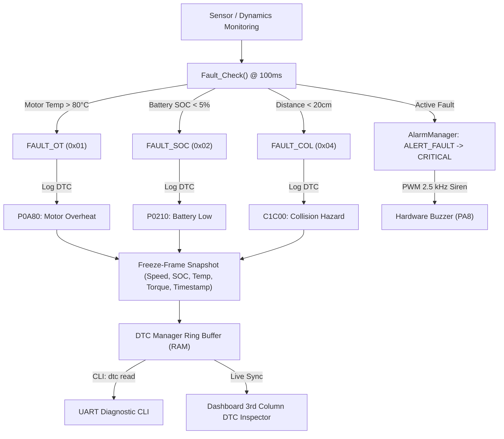

# EV ADAS Dashboard & Automotive Embedded Platform

[-blue.svg)](https://www.st.com/en/microcontrollers-microprocessors/stm32f103c8.html)
[](https://lcgamboa.github.io/picsimlab/)
[](https://fastapi.tiangolo.com/)
[](https://vitejs.dev/)
[]()

An advanced, simulation-first **Automotive Network Operations Center (NOC) and Electronic Control Unit (ECU) Software Platform**. The system models full-vehicle traction dynamics, advanced driver-assistance safety systems (ADAS), priority-queued audible alerting, ISO/SAE diagnostic trouble codes (DTC) with freeze-frame capture, flash non-volatile memory persistence, and a 48-byte SLIP-encoded binary telemetry pipeline streaming from an ARM Cortex-M3 microcontroller to a real-time web telemetry cockpit.

```
+----------------------------------------------------------------------------------------------------------------------+
|                                              EV ADAS PLATFORM EVOLUTION                                              |
|                                                                                                                      |
|  [V1: Simulated Base]  ===>  [V2 P1: Web NOC & Protocol]  ===>  [V2 P2: Embedded Platform]  ===>  [V3: Multi-ECU]    |
|   - Bare-Metal Loop           - WebSocket Bridge                - TIM1 PWM Hardware Buzzer      - FreeRTOS Preemption|
|   - 1Hz UART ASCII            - React / Vite UI                 - Modular Alarm Manager         - Virtual CAN Bus    |
|   - Matplotlib GUI            - SQLite Logs & Replay            - Binary SLIP Protocol (48B)    - Multi-Node ECUs    |
|   (COMPLETED)                 (COMPLETED)                       (COMPLETED)                     (PLANNED)            |
+----------------------------------------------------------------------------------------------------------------------+
```

---

## Project Overview

Modern electric vehicles are software-defined, safety-critical computers. Developing and verifying automotive software requires end-to-end integration across low-level peripheral drivers, real-time safety supervisors, high-frequency telematics streams, and remote diagnostic gateways.

This platform bridges embedded firmware engineering and full-stack cloud-edge telematics using a **Hardware-in-the-Loop (HIL) simulation methodology**:
1. **STM32 Bare-Metal Firmware**: Runs on an ARM Cortex-M3 (STM32F103C8T6 emulated in PICSimLab), executing physics models, sensor fusion, alarm priority arbitration, DTC freeze-frame captures, and Flash NVM persistence.
2. **Deterministic Safety Path**: The hardware audible buzzer is driven directly by on-chip timer PWM (`TIM1_CH1` on `PA8`), operating autonomously with sub-10ms response times independent of the web dashboard.
3. **Telemetry & Gateway Bridge**: A Python FastAPI daemon buffers serial packets, verifies CRC-16 checksums, logs historical drives into SQLite WAL databases, and broadcasts telemetry to clients via WebSockets.
4. **Automotive Web NOC Dashboard**: A React 19 + Vite dashboard featuring bird's-eye radar vector visualization, real-time dials, rolling telemetry charts, trip replay (with seek & variable playback speed), and an interactive serial diagnostic CLI.

---

## Why This Project Exists

Testing automotive embedded systems on physical test benches is expensive and hardware-constrained. This project provides a **100% simulation-first, repeatable automotive software testbed** that allows embedded engineers to:
* Develop and profile hard real-time vehicle control loops and safety supervisors without physical vehicle hardware.
* Stress-test emergency braking (AEB), forward collision warnings (FCW), and blind-spot detection (BSD) using simulated ultrasonic distance streams.
* Verify flash memory durability, power-cut recovery, and diagnostic freeze-frame captures.
* Analyze protocol efficiency by comparing ASCII CSV telematics against packed binary SLIP framing.

---

## Key Features

### 1. EV Traction Dynamics & Power Train
* **Physics Engine**: Euler-integrated vehicle kinematics modeling accelerator torque demand, regenerative braking, aerodynamic drag ($F_{drag} = \frac{1}{2} \rho C_d A v^2$), and rolling resistance.
* **Energy & Range Estimation**: Coulomb-counting State-of-Charge (SOC) integration with battery depletion and dynamic range estimation.
* **Drive Profiles**: Selectable runtime driving modes:
  * **ECO**: 60% torque scaling for maximum range efficiency.
  * **NORMAL**: 100% standard torque response.
  * **SPORT**: 130% boost curve for rapid acceleration.

### 2. Advanced Driver Assistance Systems (ADAS)
* **Forward Collision Warning (FCW)**: Dynamic obstacle distance tracking with 3-stage severity (Nominal, Warning $< 50\text{ cm}$, Critical $< 20\text{ cm}$).
* **Time-to-Collision (TTC)**: Real-time velocity vector calculation ($\text{TTC} = \frac{d_{front}}{v_{rel}}$) triggering emergency warnings if $\text{TTC} < 3.0\text{ s}$ or critical alarms if $\text{TTC} < 1.5\text{ s}$.
* **Blind Spot Detection (BSD)**: Velocity-gated ($> 20\text{ km/h}$) lateral ultrasonic proximity tracking.
* **Hysteresis Filtering**: 3-sample debounce counters preventing alarm chatter near threshold boundaries.

### 3. Independent Hardware Safety & Audible Alerting
* **PWM Tone Generation**: Driven by STM32 Timer 1 (`TIM1_CH1` on pin `PA8`), generating distinct tone profiles:
  * **Advisory**: Single $1.2\text{ kHz}$ chirp (150ms ON).
  * **Warning**: $1.2\text{ kHz}$ pulsed tone (200ms ON / 800ms OFF).
  * **Critical Alarm**: $2.5\text{ kHz}$ urgent siren (100ms ON / 100ms OFF).
* **Modular Alarm Manager**: Multi-channel priority arbiter ensuring safety-critical shutdown alarms (`ALERT_FAULT`) immediately suppress lower-priority warnings (`ALERT_FCW`, `ALERT_BSD`, `ALERT_OVERSPEED`).
* **Hardware Isolation**: Alarm arbitration and tone generation run entirely inside STM32 firmware; safety alerts function even if the serial link or web cockpit disconnects.

### 4. Automotive Diagnostics & Event Framework
* **Standardized DTC Registry**: Maps system failures to ISO/SAE diagnostic trouble codes:
  * `P0A80`: Motor Over-Temperature Limit Exceeded ($> 80^\circ\text{C}$).
  * `P0210`: Battery State of Charge Critically Low ($< 5\%$).
  * `C1C00`: Forward Collision Critical Safety Breach ($< 20\text{ cm}$).
  * `C1A00`: Blind Spot Lateral Hazard Detected.
* **Freeze-Frame Capture**: Automatically snapshots dynamic metrics (speed, SOC, motor temp, torque, timestamp) at the exact millisecond a fault transitions to active.
* **Event Manager**: Thread-safe circular event queue capturing timestamped state transitions (`INFO`, `WARNING`, `CRITICAL`) and flushing them over UART.
* **CLI Diagnostic Shell**: Interactive terminal supporting `dtc read`, `dtc clear`, `config read`, `config reset`, `status`, `mode`, and virtual fault injection (`fault inject motor|soc|col`).

### 5. Flash NVM Configuration Manager
* **Persistent Storage**: Allocates on-chip Flash Page 63 (`0x0800FC00`) for non-volatile parameter persistence.
* **Validation Signature**: Structured with `CONFIG_MAGIC = 0x45564346` ("EVCF"), schema versioning, and byte-parity checksum verification.
* **Runtime Calibration**: Allows on-the-fly adjustment of safety thresholds (`fcw_warn`, `fcw_crit`, `ttc_warn`, `bsd_dist`, `overspeed`) via CLI or Web UI that persist across MCU power cycles and resets.
* **Failsafe Recovery**: Automatic detection of blank or corrupted flash pages with automatic fallback to factory defaults.

### 6. 48-Byte SLIP Binary Telemetry Protocol
* **Bandwidth Optimization**: Replaces heavy ASCII strings with a 48-byte packed C struct (`#pragma pack(push, 1)`).
* **Frame Delimitation**: Uses standard Serial Line Internet Protocol (SLIP, `0xC0`) with byte-escaping (`0xDB 0xDC`, `0xDB 0xDD`).
* **Integrity Validation**: CRC-16-CCITT (`0x1021`, init `0xFFFF`) calculated over payload bytes prior to transmission.
* **Dual-Mode Reception**: Python gateway seamlessly unpacks high-rate binary frames at 20Hz while routing interleaved ASCII diagnostic logs to the web terminal.

---

## System Architecture



---

## Version Evolution

| Version | Status | Architectural Contribution | Key Technologies |
| :--- | :---: | :--- | :--- |
| **Version 1** | **COMPLETED** | Initial bare-metal baseline with cooperative scheduler, basic EV dynamics, 3-channel ultrasonic ranging, contactor safety trip, and Matplotlib serial plotter. | C (STM32 HAL), PICSimLab, Python Matplotlib |
| **Version 2 – Phase 1** | **COMPLETED** | Modern Web NOC dashboard, high-throughput serial-to-WebSocket bridge, SQLite WAL session recording, trip playback engine with variable seeking, and CRC-16 verified ASCII framing. | React 19, Vite, Tailwind CSS, FastAPI, SQLite, WebSockets |
| **Version 2 – Phase 2** | **COMPLETED** | Hardware buzzer PWM audio alerts on `PA8`, modular alarm priority arbiter, event logging queue, standard DTC freeze-frame registry, Driver Abstraction Layer (DAL), Flash Page 63 configuration persistence, and 48-byte SLIP binary telematics. | Embedded C, Flash NVM, SLIP Framing, CRC-16, React Diagnostic Console |
| **Version 3** | **PLANNED** | Multi-node distributed architecture with FreeRTOS preemptive scheduling, virtual CAN Bus (ISO 11898), ISO 14229 (UDS) diagnostics, and 3D WebGL Digital Twin visualization. | FreeRTOS, Virtual CAN (SocketCAN), UDS / ISO 14229, Three.js |

---

## Technology Stack

### Embedded Firmware
| Component | Technology / Implementation | Details |
| :--- | :--- | :--- |
| **Microcontroller** | STM32F103C8T6 (ARM Cortex-M3 @ 72 MHz) | Emulated in PICSimLab HIL Environment |
| **Core Libraries** | STM32Cube HAL + Custom Driver Abstraction Layer | Low-level hardware decoupling |
| **Scheduler** | Multi-Rate Cooperative Scheduler | TIM1 (10ms EV loop) & TIM3 (100ms ADAS loop) |
| **Audible Alerting**| Hardware Timer PWM (`TIM1_CH1` on `PA8`) | 1.2 kHz Advisory/Warning, 2.5 kHz Critical Siren |
| **Non-Volatile Storage** | On-Chip Flash Memory (Page 63 @ `0x0800FC00`) | 1 KB parameter persistence with CRC validation |
| **Communication** | USART1 (115200 Baud, 8N1) | SLIP Binary Telemetry + ASCII Shell Multiplexing |

### Gateway & Telemetry Bridge
| Component | Technology | Role |
| :--- | :--- | :--- |
| **Web Framework** | Python 3.10+ / FastAPI / Uvicorn | Asynchronous Gateway Daemon |
| **Serial Engine** | PySerial with thread-safe ring buffering | High-rate serial I/O and frame parsing |
| **Database** | SQLite3 with Write-Ahead Logging (WAL) | Persistent drive cycle session logging |
| **Network Bus** | WebSockets (`ws://localhost:8080/ws`) | 20Hz full-duplex telemetry and CLI pipeline |

### Frontend Diagnostics Cockpit
| Component | Technology | Role |
| :--- | :--- | :--- |
| **Framework** | React 19 + Vite | High-performance SPA frontend |
| **Styling** | Tailwind CSS + Lucide Icons | NOC-style dark theme dashboard |
| **Visualizations** | Custom HTML5 Canvas + Recharts | 2D vector radar vehicle & scrolling time-series |
| **Diagnostics** | Custom CLI Shell & DTC Card Grid | Remote ECU inspection and parameter tuning |

---

## Hardware & Simulation Pin Mapping

```
                         STM32F103C8T6 (Blue Pill)
                              +--------------+
            Pot: Accelerator -| PA0      PB0 |- HC-SR04: Front Trigger
                  Pot: Brake -| PA1      PB1 |- HC-SR04: Front Echo
                              | PA2      PB2 |- HC-SR04: Left Trigger
            Pot: Motor Temp  -| PA3      PB3 |- HC-SR04: Left Echo
                              | PA4      PB4 |- HC-SR04: Right Trigger
                              | PA5      PB5 |- HC-SR04: Right Echo
                              | PA6      PB6 |- [Reserved]
                              | PA7      PB7 |- [Reserved]
          Buzzer PWM (TIM1)  -| PA8      PB8 |- LED: Collision Warning
             USART1 TX (Bridge)-| PA9      PB9 |- LED: Blind-Spot Left
           USART1 RX (Bridge)-| PA10    PB10 |- LED: Blind-Spot Right
                              | PA11    PB11 |- LED: Motor Contactor Trip
                              | PA12    PB12 |- [Reserved]
                              +--------------+
```

---

## Telemetry Protocol Specification

The platform utilizes a **48-byte packed binary telemetry structure** framed via Serial Line Internet Protocol (SLIP) with CRC-16 integrity verification:

### Binary Packet Structure (`TelemetryPacket_t`)
```text
+--------+--------+--------+--------+--------+--------+--------+--------+--------+--------+
| Offset | Field           | Type   | Size   | Units  | Range           | Description     |
+--------+--------+--------+--------+--------+--------+--------+--------+--------+--------+
| 0x00   | magic           | uint16 | 2 B    | -      | 0xAA55          | Sync Marker     |
| 0x02   | version         | uint8  | 1 B    | -      | 1               | Protocol Rev    |
| 0x03   | type            | uint8  | 1 B    | -      | 'D' (0x44)      | Frame Type      |
| 0x04   | timestamp       | uint32 | 4 B    | ms     | 0 – 2^32-1      | MCU Uptime      |
| 0x08   | seq_id          | uint32 | 4 B    | -      | 0 – 2^32-1      | Rolling Counter |
| 0x0C   | speed_kmh       | float  | 4 B    | km/h   | 0.0 – 160.0     | Vehicle Speed   |
| 0x10   | soc_pct         | float  | 4 B    | %      | 0.0 – 100.0     | Battery SOC     |
| 0x14   | motor_torque    | int16  | 2 B    | Nm     | -150 – +300     | Torque Demand   |
| 0x16   | motor_temp_c    | float  | 4 B    | °C     | 0.0 – 120.0     | Motor Temp      |
| 0x1A   | range_km        | uint16 | 2 B    | km     | 0 – 500         | Estimated Range |
| 0x1C   | accel_pedal     | uint8  | 1 B    | %      | 0 – 100         | Accelerator Pos |
| 0x1D   | brake_pedal     | uint8  | 1 B    | %      | 0 – 100         | Brake Pos       |
| 0x1E   | front_cm        | uint16 | 2 B    | cm     | 2 – 400         | Front Obstacle  |
| 0x20   | left_cm         | uint16 | 2 B    | cm     | 2 – 400         | Left Obstacle   |
| 0x22   | right_cm        | uint16 | 2 B    | cm     | 2 – 400         | Right Obstacle  |
| 0x24   | ttc_sec         | float  | 4 B    | s      | 0.0 – 99.9      | Time-to-Collide |
| 0x28   | collision_warn  | uint8  | 1 B    | enum   | 0=None, 1=W, 2=C | FCW State       |
| 0x29   | blindspot_left  | uint8  | 1 B    | bool   | 0=Clear, 1=Alert| Left BSD Flag   |
| 0x2A   | blindspot_right | uint8  | 1 B    | bool   | 0=Clear, 1=Alert| Right BSD Flag  |
| 0x2B   | alarm_priority  | uint8  | 1 B    | enum   | 0–3             | Alert Priority  |
| 0x2C   | fault_flags     | uint8  | 1 B    | mask   | 0x01/0x02/0x04  | Latching Faults |
| 0x2D   | drive_mode      | uint8  | 1 B    | enum   | 0=ECO, 1=N, 2=S  | Drive Mode      |
| 0x2E   | crc16           | uint16 | 2 B    | hex    | 0x0000 – 0xFFFF | CRC-16 Checksum |
+--------+--------+--------+--------+--------+--------+--------+--------+--------+--------+
Total Struct Payload: 48 Bytes
```

### SLIP Framing & Escaping
* **Frame Boundary**: Every binary frame is bounded by `SLIP_END = 0xC0`.
* **Byte Escaping**:
  * Any byte equal to `0xC0` is encoded as `0xDB 0xDC`.
  * Any byte equal to `0xDB` is encoded as `0xDB 0xDD`.

---

## Diagnostics & Trouble Code Architecture



---

## Quick Start & Execution Guide

### Prerequisites
* **STM32CubeIDE** (or `arm-none-eabi-gcc` + `make`)
* **PICSimLab** (v0.9.0+ with STM32F103C8 emulated board)
* **Python 3.10+** (with `pip` and virtual environment support)
* **Node.js 18+** & `npm`
* **com0com** (or physical USB-UART adapter for COM port loopback)

---

### Step 1: Compile & Run STM32 Firmware in PICSimLab
1. Open **STM32CubeIDE** and import the project root (`d:\Projects\Internship\Emertxe\ev_dash`).
2. Build the project (**`Ctrl + B`**) to generate `Debug/ev_dash.hex`.
3. Open **PICSimLab**:
   * Select Board: **Blue Pill (STM32F103C8T6)**.
   * Go to **Modules** $\rightarrow$ Configure Serial Port to **COM2** (115200 baud).
   * Go to **File** $\rightarrow$ **Load Hex** $\rightarrow$ Select `Debug/ev_dash.hex`.
   * The MCU will boot, initialize peripherals, and begin broadcasting telemetry frames.

---

### Step 2: Launch Telemetry Bridge Gateway
```bash
# Navigate to telemetry bridge directory
cd telemetry_bridge

# Create and activate virtual environment
python -m venv venv
# Windows:
venv\Scripts\activate
# Linux/macOS:
source venv/bin/activate

# Install dependencies
pip install -r requirements.txt

# Start the bridge (connecting to paired COM1 port)
python bridge.py --port COM1 --baud 115200
```
*The bridge will open `COM1` @ 115200 baud, start SQLite session logging in `telemetry.db`, and start the WebSocket server at `http://127.0.0.1:8080`.*

---

### Step 3: Launch React NOC Dashboard
```bash
# In a new terminal, navigate to the dashboard directory
cd dashboard

# Install dependencies
npm install

# Start Vite development server
npm run dev
```
*Open your browser and navigate to `http://localhost:5173` to access the live automotive cockpit.*

---

## Project Structure

```text
ev_dash/
├── Core/
│   ├── Inc/
│   │   ├── adas.h                # ADAS thresholds, TTC formulas, and state handles
│   │   ├── alarm_manager.h       # Priority-queued alert engine interface
│   │   ├── buzzer.h              # Hardware PWM buzzer pattern driver
│   │   ├── common.h              # Pin aliases, math clamps, and vehicle enums
│   │   ├── config_manager.h      # Flash Page 63 NVM configuration schema
│   │   ├── crc16.h               # CRC-16-CCITT implementation header
│   │   ├── dal_adc.h             # DAL: Multi-channel regular ADC scan wrapper
│   │   ├── dal_flash.h           # DAL: Flash page erase/write/read driver
│   │   ├── dal_timer.h           # DAL: Hardware timer PWM and microsecond delay
│   │   ├── dal_uart.h            # DAL: Serial communication wrapper
│   │   ├── dtc_manager.h         # Standard DTC registry and freeze-frame structs
│   │   ├── ev_control.h          # EV traction kinematics and battery physics
│   │   ├── event_manager.h       # Circular event queue publisher
│   │   ├── fault.h               # Safety fault flags and latching state handles
│   │   ├── main.h                # HAL core includes and clock prototypes
│   │   ├── telemetry_encoder.h   # SLIP encoder interface
│   │   ├── telemetry_protocol.h  # 48-byte packed binary packet definitions
│   │   ├── uart_shell.h          # Ring-buffered diagnostic CLI interpreter
│   │   └── ultrasonic.h          # HC-SR04 input capture ultrasonic drivers
│   └── Src/
│       ├── adas.c                # ADAS distance fusion and TTC calculations
│       ├── alarm_manager.c       # Priority resolution and audio routing
│       ├── buzzer.c              # PWM frequency and duty-cycle audio driver
│       ├── config_manager.c      # Flash NVM parameter persistence and defaults
│       ├── crc16.c               # CRC-16-CCITT calculation table
│       ├── dal_adc.c             # DAL ADC implementation
│       ├── dal_flash.c           # DAL Flash page programming implementation
│       ├── dal_timer.c           # DAL Timer PWM & delay implementation
│       ├── dal_uart.c            # DAL UART transmission implementation
│       ├── dtc_manager.c         # DTC snapshotting and UART dump routines
│       ├── ev_control.c          # EV dynamics model and pedal mapping
│       ├── event_manager.c       # Event publishing and queue management
│       ├── fault.c               # Safety fault supervisor and contactor trip
│       ├── main.c                # Main scheduler loop, ISRs, and entry point
│       ├── telemetry_encoder.c   # SLIP packet framing and byte escaping
│       ├── uart_shell.c          # Interactive CLI command parser
│       └── ultrasonic.c          # Ultrasonic trigger and echo capture
├── telemetry_bridge/
│   ├── app/
│   │   ├── crc16.py              # Python CRC-16-CCITT implementation
│   │   ├── database.py           # SQLite WAL trip logging and session manager
│   │   ├── parser.py             # SLIP binary packet decoder & struct unpacker
│   │   ├── replay_mgr.py         # Historical drive cycle playback engine
│   │   ├── serial_mgr.py         # PySerial thread and stream packet framer
│   │   └── uvicorn_server.py     # FastAPI application and WebSocket router
│   ├── bridge.py                 # Bridge daemon entry point CLI
│   └── requirements.txt          # Python dependencies (FastAPI, PySerial, etc.)
├── dashboard/
│   ├── src/
│   │   ├── components/
│   │   │   ├── AdasCanvas.jsx    # Bird's-eye vector radar canvas
│   │   │   ├── DashboardLayout.jsx # NOC layout shell and navigation
│   │   │   ├── MetricGauge.jsx   # Radial SVG speed and SOC dial gauges
│   │   │   ├── StatusHeader.jsx  # Top alert banner and connection status
│   │   │   └── TelemetryChart.jsx# Scrolling 60s historical time-series chart
│   │   ├── App.jsx               # Master state orchestrator, CLI, and DTC viewer
│   │   └── index.css             # Tailwind design tokens and glassmorphism styling
│   ├── package.json              # Node dependencies (React 19, Lucide, Recharts)
│   └── vite.config.js            # Vite build configuration
├── ARCHITECTURE.md               # Authoritative technical architecture specification
├── ROADMAP.md                    # Strategic evolution roadmap (V1 -> V2 -> V3)
└── ev_dash.ioc                   # STM32CubeMX peripheral hardware configuration
```

---

## Future Roadmap: Version 3

Version 3 will evolve this single-ECU system into a **distributed multi-node automotive architecture**:
* **FreeRTOS Preemptive Kernel**: Replacing the cooperative scheduler with preemptive tasks for Traction Control ($100\text{ Hz}$), ADAS ($50\text{ Hz}$), CAN Network Comms ($20\text{ Hz}$), and Diagnostic Services ($10\text{ Hz}$).
* **Virtual CAN Bus (ISO 11898)**: Linking simulated Electronic Control Units (Vehicle Control Unit, ADAS Radar Node, and Body Control Gateway) over a simulated CAN network.
* **Unified Diagnostic Services (ISO 14229 / UDS)**: Expanding DTC diagnostics into formal UDS services (`0x19` ReadDTCInformation, `0x14` ClearDiagnosticInformation, `0x22` ReadDataByIdentifier).
* **3D WebGL Digital Twin**: Upgrading the 2D canvas into a real-time 3D vehicle representation with dynamic obstacle lighting and camera perspectives.

*For complete milestones and architecture breakdown, refer to [ROADMAP.md](file:///d:/Projects/Internship/Emertxe/ev_dash/ROADMAP.md).*

---

## Engineering Outcomes Demonstrated

* **Automotive Firmware Engineering**: Bare-metal embedded C, rate-monotonic scheduling, state machines, interrupt handlers, and Driver Abstraction Layer (DAL) design.
* **Functional Safety & Fault Supervisors**: Contactor tripping, priority-queued alarm management, hardware PWM siren generation, and fail-safe state transitions.
* **Diagnostic Protocol Design**: ISO/SAE Diagnostic Trouble Codes (DTC), freeze-frame memory snapshotting, event queues, and non-volatile Flash NVM persistence.
* **Network & Serialization Protocols**: 48-byte packed binary C struct design, SLIP framing, byte-escaping, and CRC-16 error detection.
* **Full-Stack Telemetry & NOC Tooling**: High-rate serial streaming, Python FastAPI gateways, SQLite WAL databases, WebSocket multiplexing, and modern React 19 dashboards.

