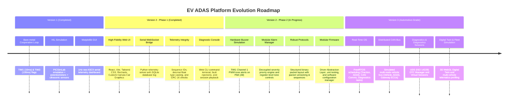
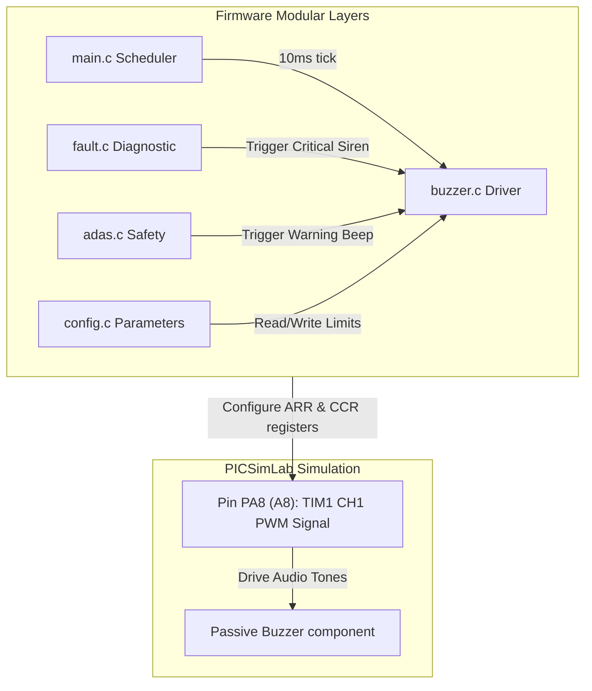
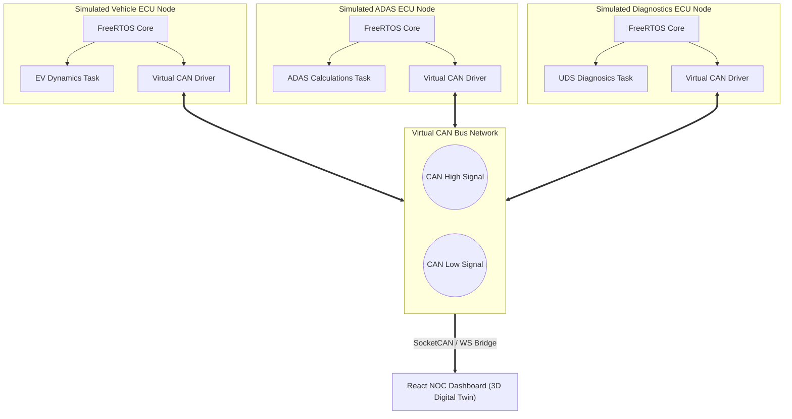

# Strategic Evolution Roadmap: EV ADAS Dashboard Platform

This document outlines the strategic product vision, architectural evolution, and technical roadmap for transforming the **EV ADAS Dashboard** from a simulated baseline into a production-grade, flagship **Automotive Embedded Software Platform**.

The roadmap is structured to demonstrate progression in **Firmware Architecture**, **Real-Time Systems (RTOS)**, **Automotive Protocols (CAN, UDS)**, **Full-Stack Telemetry**, and **System Profiling**—all executed within a simulation-first methodology.

---

## 1. Project Vision

Modern electric vehicles (EVs) are software-defined, safety-critical computers. A successful automotive engineer must understand not only low-level microcontrollers but also how telemetry flows from sensor edges, across robust network buses, through gateway processors, and into high-level diagnostics interfaces.

The **EV ADAS Dashboard Platform** is designed to mirror this exact data flow. By focusing on **software and firmware sophistication in simulation**, we avoid hardware configuration bottlenecks and focus entirely on high-fidelity embedded engineering. The ultimate goal is to build an open, visual, and highly authentic representation of an **Automotive Network Operations Center (NOC)** and diagnostic cockpit that showcases industry-standard engineering skills.

```
+----------------------------------------------------------------------------------------------------------------------+
|                                              EV ADAS PLATFORM EVOLUTION                                              |
|                                                                                                                      |
|  [V1: Simulated Base]  ===>  [V2 P1: Web NOC & Protocol]  ===>  [V2 P2: Software Platform]  ===>  [V3: Multi-ECU Platform] |
|   - Bare-Metal Loop           - WebSocket Bridge                - TIM1 PWM Hardware Buzzer      - FreeRTOS Preemption        |
|   - 1Hz UART ASCII            - React / Vite UI                 - Modular Alarm Manager         - Virtual CAN Bus            |
|   - Matplotlib GUI            - SQLite Logs & Replay            - Binary Telemetry Protocol     - Multiple Simulated ECUs    |
|   (COMPLETED)                 (COMPLETED)                       (COMPLETED / PLANNED)           (PLANNED)                    |
+----------------------------------------------------------------------------------------------------------------------+
```

---

## 2. Evolution Timeline

The system evolves through four major steps to ensure a structured, buildable, and modular path of execution.



---

## 3. Version Breakdowns

### Version 1: Simulated HIL Base (Completed)

This version represents the initial baseline. It establishes the mathematical models for electric vehicle dynamics and basic safety-critical ADAS calculations using virtualized hardware.

*   **Objectives**:
    *   Develop a cooperative rate-monotonic scheduler on a bare-metal ARM Cortex-M3 (STM32F103C8T6).
    *   Implement EV traction dynamics (Euler integration of torque and drag) and battery State-of-Charge (SOC) math.
    *   Process three ultrasonic range sensors to calculate Time-to-Collision (TTC) with hysteresis filtering.
    *   Establish a safety fault manager that transitions the vehicle to a `STATE_FAULT` safe state (contactor tripped, zero torque) upon motor overheat, dead battery, or critical collision.
*   **Architecture & Firmware**:
    *   *Scheduler*: Introduced a single-core cooperative scheduler triggered by hardware timers: TIM1 (10ms) drives the EV dynamics engine; TIM3 (100ms) drives ADAS updates, fault checks, and command execution.
    *   *Drivers*: Regular multi-channel ADC polling, interrupt-based microsecond timing on TIM2 for HC-SR04 echo duration capture, ring-buffered UART interrupt handling.
    *   *Application*: State-machine logic transitioning between `STATE_PARKED`, `STATE_READY`, `STATE_DRIVING`, `STATE_REGEN`, and `STATE_FAULT`.
*   **Dashboard & Communication**:
    *   Matplotlib telemetry rendering dashboard (`ev_dashboard.py`).
    *   Point-to-point UART over Virtual COM port at 115200 8N1. Telemetry frames are streamed at 1.0 Hz in ASCII format.
*   **Estimated Difficulty & Timeline**: Medium | Completed (4 weeks).

---

### Version 2 - Phase 1: Web NOC Dashboard & Telemetry Protocol (Completed)

This version shifts focus to the visualization stack and communication security. It replaces the slow Matplotlib GUI with a modern, high-performance web dashboard and improves data integrity on the serial line.

*   **Objectives**:
    *   Build a high-performance, non-blocking React + Vite web dashboard displaying real-time telemetry.
    *   Create a Python FastAPI bridge that converts serial bytes to WebSockets and logs data to SQLite.
    *   Redesign the telemetry protocol to include packet framing, sequence counters, and a CRC-16 verification step.
    *   Enable telemetry recording and post-trip replay directly from the web browser.
*   **Architecture & Firmware**:
    *   *Decoupled Services*: The Python daemon runs as a background service, handling high-rate serial port reading, SQLite WAL database writes, and WebSocket broadcasts.
    *   *Firmware changes*: Telemetry transmission frequency increased to 10 Hz (100ms update rate). Implemented CRC-16-CCITT (`0x1021`) generation in C. Upgraded command interpreter to validate the CRC-16 of commands received from the Python bridge.
*   **Dashboard & Client UI**:
    *   *NOC Dashboard Design*: Grid-based layout featuring dial gauges, scrolling charts, and an interactive bird's-eye canvas rendering a vector sports car with active headlight/tail-light indicators.
    *   *Controls*: Embedded Web CLI console, diagnostic fault injection buttons (OT, SOC, COL), and a trip replay console supporting play, pause, seek, and speed factors (0.5x to 4x).
*   **Estimated Difficulty & Timeline**: High | Completed (6 weeks).

---

### Version 2 - Phase 2: Simulation-Based Embedded Platform (In Progress)

This phase refines firmware modularity, diagnostic precision, and protocol overheads. All features are developed and verified within the PICSimLab simulation environment.



*   **Objectives**:
    *   Integrate a hardware-level audible warning system using STM32 timers to output PWM signals.
    *   Decouple safety alarms and tone priorities into a modular Alarm Manager.
    *   Implement persistent config parameter stores and diagnostic trouble logging.
    *   Optimize serial bandwidth by transitioning to a versioned binary telemetry format.
*   **Planned Features**:
    *   **Hardware Buzzer Integration (v2.1)**: Developed `buzzer.h`/`buzzer.c` mapping `TIM1_CH1` to pin `PA8` (`A8` on board). Ticks a non-blocking state machine to output $1.2\text{ kHz}$ warning beeps (200ms ON / 800ms OFF) and $2.5\text{ kHz}$ critical sirens (100ms ON / 100ms OFF) depending on active alarms. (COMPLETED).
    *   **Modular Alarm Manager**: Create a software module that handles prioritized warning queues (e.g. system faults override blind-spots) and maps them to the buzzer driver.
    *   **Persistent Configuration Manager**: Emulate EEPROM / Non-Volatile Flash writes inside the STM32 memory partition to store warning limits (FCW thresholds, speed gates) that survive device resets.
    *   **DTC & Diagnostic trouble codes**: Implement a diagnostic trouble code (DTC) register mapping failures to standard codes (e.g., `OT` fault $\rightarrow$ `DTC_MOTOR_OVERHEAT`). Capture freeze-frame datasets (snapshot of speed, SOC, temp) on failure.
    *   **Binary Telemetry Protocol**: Replace the ASCII telemetry string with a structured, packed binary format (e.g., COBS or SLIP framed) to reduce serial transmission bandwidth and improve CPU packaging performance.
    *   **Firmware Modularization & Unit Testing**: Establish a clean Driver Abstraction Layer (DAL) to isolate peripheral registers from core ADAS math, and implement mock test runners to validate dynamics equations.
*   **Estimated Difficulty & Timeline**: High | 4 Weeks.

---

### Version 3: Automotive Embedded Software Platform in Simulation (Advanced Stage)

This version elevates the project to a production-style distributed automotive architecture. The system executes a real-time operating system (FreeRTOS) and models a virtual CAN Bus network linking multiple simulated Electronic Control Units (ECUs)—all running completely in simulation.



*   **Objectives**:
    *   Migrate the cooperative firmware to FreeRTOS to implement preemptive multitasking and task synchronization.
    *   Design a distributed virtual CAN Bus network connecting multiple simulated ECUs.
    *   Implement an ISO 14229 (UDS) style diagnostic engine supporting diagnostic sessions and security access.
    *   Incorporate a 3D WebGL Digital Twin and a multi-vehicle fleet simulation interface.
*   **Planned Features**:
    *   **FreeRTOS Integration**: Replace cooperative scheduler flags with a real-time operating system:
        *   `TaskEVDynamics` (10ms, High Priority): Pedal reads and motor dynamics equations.
        *   `TaskADASMonitor` (20ms, High Priority): Range calculation and obstacle safety.
        *   `TaskCANComms` (50ms, Medium Priority): Network queue packaging and CAN frame dispatch.
        *   `TaskDiagnostics` (100ms, Low Priority): DTC storage and UDS query processing.
        *   *Synchronization*: Use Mutexes for shared telemetry structures and Semaphores for sensor trigger signaling.
    *   **Distributed Virtual Multi-ECU Network**: Simulate three separate ECU nodes communicating over a virtual CAN bus (using SocketCAN, virtual CAN interfaces, or bridge routing):
        1.  **Vehicle Control ECU**: Gathers pedal inputs, calculates speed/torque, and manages contactors.
        2.  **ADAS Safety ECU**: Evaluates ultrasonic sensor readings, checks blind spots, and triggers alarms.
        3.  **Gateway/Diagnostics ECU**: Captures CAN frames, interfaces with the PC serial link, and processes diagnostic requests.
    *   **UDS-Inspired Diagnostics (ISO 14229)**: Build a diagnostic server layer:
        *   Support standard Service IDs: `0x22` (Read Data by Identifier), `0x19` (Read DTC Information), `0x14` (Clear Diagnostic Information), `0x10` (Diagnostic Session Control - Default, Programming, Extended Sessions).
    *   **Digital Twin & Fleet Simulation**:
        *   *3D Digital Twin*: Integrate a WebGL/Three.js render panel into the React dashboard. The model's wheels spin relative to speed telemetry, brake lights trigger on deceleration, and active color overlays visualize surrounding obstacle distances in 3D.
        *   *Multi-Vehicle Simulation*: Upgrade the FastAPI backend to host virtual fleet nodes, allowing the React dashboard to swap between multiple simultaneous virtual vehicles.
    *   **Profiling & Automated Testing**: Add firmware profiling (CPU duty cycles per task) and network bus utilization analysis, along with automated CI test scripts to validate safety algorithms.
*   **Estimated Difficulty & Timeline**: Advanced | 8 Weeks.

---

## 4. Key Performance Indicators (KPIs) & Comparison

The table below illustrates how each version improves key performance metrics, transitioning the project from a student demonstration into a professional portfolio.

| Metric / Parameter | Version 1 (Simulation Base) | Version 2 - Phase 1 (Web NOC) | Version 2 - Phase 2 (Modular) | Version 3 (Automotive Platform) |
|---|---|---|---|---|
| **Architecture** | Single Core Bare-Metal | Single Core + Web Client Bridge | Single Core + Web Client Bridge | Distributed Multi-ECU Simulation |
| **Scheduler** | Cooperative Bare-Metal Loop | Cooperative Bare-Metal Loop | Rate-Monotonic Scheduler | FreeRTOS Preemptive Tasks |
| **Telemetry Rate** | 1.0 Hz | 10.0 Hz | 20.0 Hz (binary packet) | 50.0 Hz (per CAN node broadcast) |
| **Integrity Checks**| None (Raw ASCII Regex) | CRC-16 Checksum verification | CRC-16 Checksum verification | CAN Hardware CRC-15 + UDS checks |
| **Diagnostics** | Basic UART ASCII Shell | Web CLI Shell + Fault Center | CLI + DTC Logging + Freeze Frames | UDS (ISO 14229) Sessions |
| **UI Rendering** | Matplotlib (~5 FPS) | React / Tailwind (WebSocket) | React / Tailwind (WebSocket) | React + Three.js 3D Twin |
| **Difficulty Level**| Medium | High | High | Advanced |
| **Development Time**| 4 Weeks (completed) | 6 Weeks (completed) | 4 Weeks (In progress) | 8 Weeks |

---

## 5. Architectural & Design Philosophy

1.  **Safety-Critical Separation**: Low-level safety controls (ADAS thresholds, torque calculations, contactor triggers, alarm patterns) must always run on the local microcontroller firmware. The host dashboard acts only as a monitor and command interface; it cannot override safety decisions.
2.  **Telemetry Decoupling**: We separate data collection from UI rendering. By inserting a WebSocket bridge and an SQLite database between the microcontroller and the browser, we prevent UI rendering delays from blocking telemetry data streams.
3.  **Automotive Standards Realism**: The transition from UART to a CAN Bus network and UDS-compliant DTC diagnostic logging mirrors the design patterns of production vehicles. This makes the project directly applicable to automotive engineering roles.
4.  **Simulation-First Determinism**: Developing in a virtual HIL workspace (STM32 firmware + PICSimLab + FastAPI serial routing) ensures test repeatability, reduces developer overhead, and provides an instant test environment.

---

## 6. Ideas Intentionally Excluded (Out of Scope)

*   **Autonomous Driving / Steering Automation**:
    *   *Reason*: Autonomous steering requires specialized actuators and complex computing platforms (such as ROS or Nvidia Drive) that shift the focus away from microcontrollers and firmware.
*   **Real-time Video / Camera ADAS (e.g., lane tracking, traffic light detection)**:
    *   *Reason*: Computer vision algorithms require high-performance applications processors (e.g., Raspberry Pi 4, Jetson Nano) rather than microcontrollers (e.g., STM32F103) which are the core target of this roadmap.
*   **Direct High-Voltage Battery Interfacing (dangerous voltages > 60V)**:
    *   *Reason*: Safety first. Low-voltage signals (3.3V / 5.0V) are sufficient to model dynamics, state-of-charge tracking, and relay triggering without introducing physical shock hazards.
*   **Cloud-based Telematics Database Integration (e.g., AWS IoT, remote web server hosting)**:
    *   *Reason*: Keeping the SQLite logging database local to the host PC avoids complications with network setups, remote API keys, and server subscriptions, allowing the project to remain self-contained.

---

## 7. Optional Future Hardware Deployment

While the primary development path remains 100% buildable and demonstrable in simulation, this platform is designed to ease migration to physical HIL hardware if desired:
*   *Board*: STM32F103C8T6 Blue Pill target hardware.
*   *Interfacing*: Connect physical linear potentiometers to pins `PA0`, `PA1`, `PA3` and three HC-SR04 ultrasonic sensors. Link a physical buzzer to pin `PA8`.
*   *Communication*: Connect the board to the host PC via an FTDI / CH340 USB-to-TTL UART adapter bound to the FastAPI bridge gateway.

---

## 8. Portfolio Value & Career Focus

By completing this strategic roadmap, the project becomes a robust portfolio piece demonstrating expertise in:
- **Automotive Diagnostics**: Expertise in industrial diagnostics standards (UDS, DTCs) and fault protection systems.
- **RTOS Systems**: Gaining core skills in real-time execution, multitasking scheduler architectures, and synchronization hooks (semaphores, mutexes).
- **Automotive Networks**: Expertise in CAN Bus configurations, message dict layouts, and distributed microcontrollers.
