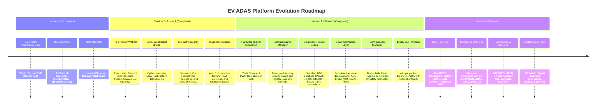
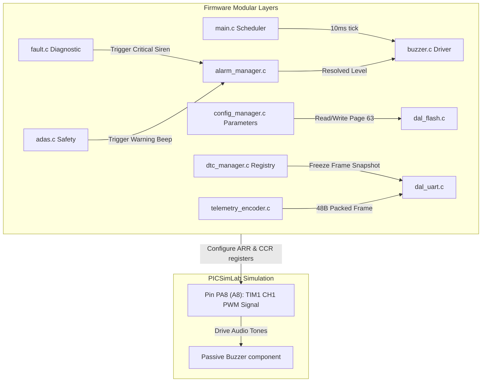
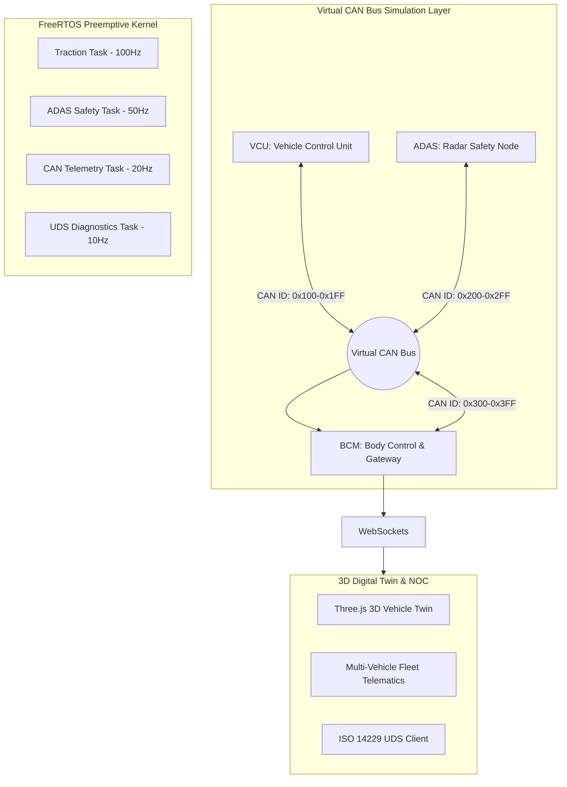

# Strategic Evolution Roadmap: EV ADAS Dashboard Platform

This document outlines the strategic product vision, architectural evolution, and technical roadmap for transforming the **EV ADAS Dashboard** from a simulated baseline into a production-style, simulation-based **Automotive Embedded Software Platform**.

The roadmap demonstrates progression in **Firmware Architecture**, **Real-Time Systems (RTOS)**, **Automotive Protocols (CAN, UDS)**, **Full-Stack Telemetry**, and **System Profiling**—all executed within a simulation-first methodology.

---

## 1. Project Vision

Modern electric vehicles (EVs) are software-defined, safety-critical computers. A successful automotive engineer must understand not only low-level microcontrollers but also how telemetry flows from sensor edges, across robust network buses, through gateway processors, and into high-level diagnostics interfaces.

The **EV ADAS Dashboard Platform** is designed to mirror this exact data flow. By focusing on **software and firmware sophistication in simulation**, we avoid hardware configuration bottlenecks and focus entirely on high-fidelity embedded engineering. The goal is to build an open, visual, and highly authentic representation of an **Automotive Network Operations Center (NOC)** and diagnostic cockpit that showcases industry-standard engineering skills.

```
+----------------------------------------------------------------------------------------------------------------------+
|                                              EV ADAS PLATFORM EVOLUTION                                              |
|                                                                                                                      |
|  [V1: Simulated Base]  ===>  [V2 P1: Web NOC & Protocol]  ===>  [V2 P2: Software Platform]  ===>  [V3: Multi-ECU]    |
|   - Bare-Metal Loop           - WebSocket Bridge                - TIM1 PWM Hardware Buzzer      - FreeRTOS Preemption|
|   - 1Hz UART ASCII            - React / Vite UI                 - Modular Alarm Manager         - Virtual CAN Bus    |
|   - Matplotlib GUI            - SQLite Logs & Replay            - Binary SLIP Protocol (48B)    - Multi-Node ECUs    |
|   (COMPLETED)                 (COMPLETED)                       (COMPLETED)                     (PLANNED)            |
+----------------------------------------------------------------------------------------------------------------------+
```

---

## 2. Evolution Timeline



---

## 3. Version Breakdowns

### Version 1: Simulated HIL Base (Completed)

This version represents the initial baseline. It establishes the mathematical models for electric vehicle dynamics and basic safety-critical ADAS calculations using virtualized hardware.

*   **Objectives**:
    *   Develop a cooperative rate-monotonic scheduler on a bare-metal ARM Cortex-M3 (STM32F103C8T6).
    *   Implement EV traction dynamics (Euler integration of torque and drag) and battery State-of-Charge (SOC) math.
    *   Process three ultrasonic range sensors to calculate Time-to-Collision (TTC) with hysteresis filtering.
    *   Establish a safety fault manager that transitions the vehicle to a `STATE_FAULT` safe state (contactor tripped, zero torque) upon motor overheat, dead battery, or critical collision.
*   **Architecture & Firmware**:
    *   *Scheduler*: Introduced a single-core cooperative scheduler triggered by hardware timers: TIM1 (10ms) drives the EV dynamics engine; TIM3 (100ms) drives ADAS updates, fault checks, and command execution.
    *   *Drivers*: Multi-channel ADC polling, interrupt-based microsecond timing on TIM2 for HC-SR04 echo duration capture, ring-buffered UART interrupt handling.
    *   *Application*: State-machine logic transitioning between `STATE_PARKED`, `STATE_READY`, `STATE_DRIVING`, `STATE_REGEN`, and `STATE_FAULT`.
*   **Dashboard & Communication**:
    *   Matplotlib telemetry rendering dashboard (`ev_dashboard.py`).
    *   Point-to-point UART over Virtual COM port at 115200 8N1. Telemetry frames streamed at 1.0 Hz in ASCII format.
*   **Status**: **COMPLETED**.

---

### Version 2 - Phase 1: Web NOC Dashboard & Telemetry Protocol (Completed)

This version shifts focus to the visualization stack and communication security. It replaces the legacy Matplotlib GUI with a modern, high-performance web dashboard and improves data integrity on the serial line.

*   **Objectives**:
    *   Build a high-performance, non-blocking React + Vite web dashboard displaying real-time telemetry.
    *   Create a Python FastAPI bridge that converts serial bytes to WebSockets and logs data to SQLite.
    *   Redesign the telemetry protocol to include packet framing, sequence counters, and a CRC-16 verification step.
    *   Enable telemetry recording and post-trip replay directly from the web browser.
*   **Architecture & Firmware**:
    *   *Decoupled Services*: The Python daemon runs as a background service, handling high-rate serial port reading, SQLite WAL database writes, and WebSocket broadcasts.
    *   *Firmware changes*: Telemetry transmission frequency increased to 10 Hz (100ms update rate). Implemented CRC-16-CCITT (`0x1021`) generation in C. Upgraded command interpreter to validate the CRC-16 of commands received from the Python bridge.
*   **Dashboard & Client UI**:
    *   *NOC Dashboard Design*: Grid-based layout featuring dial gauges, scrolling charts, and an interactive bird's-eye canvas rendering a vector sports car with active headlight/tail-light indicators.
    *   *Controls*: Embedded Web CLI console, diagnostic fault injection buttons (OT, SOC, COL), and a trip replay console supporting play, pause, seek, and speed factors (0.5x to 4x).
*   **Status**: **COMPLETED**.

---

### Version 2 - Phase 2: Simulation-Based Embedded Platform (Completed)

This phase establishes full firmware modularity, audible hardware alerting, diagnostic trouble code recording, non-volatile parameter persistence, and low-overhead binary telematics.



*   **Completed Deliverables**:
    *   **Hardware Buzzer Integration**: Developed `buzzer.h`/`buzzer.c` mapping `TIM1_CH1` to pin `PA8`. Implemented non-blocking state machine generating $1.2\text{ kHz}$ warning beeps (200ms ON / 800ms OFF) and $2.5\text{ kHz}$ critical sirens (100ms ON / 100ms OFF).
    *   **Modular Alarm Manager**: Developed `alarm_manager.h`/`alarm_manager.c` to arbitrate prioritized alert queues (`ALERT_FAULT` > `ALERT_FCW` > `ALERT_BSD` > `ALERT_OVERSPEED`) and directly drive the buzzer driver.
    *   **Event Management Framework**: Created `event_manager.h`/`event_manager.c` implementing a thread-safe circular event queue with CPU timestamps that streams diagnostic transitions over UART.
    *   **DTC & Diagnostic Trouble Codes**: Implemented `dtc_manager.h`/`dtc_manager.c` mapping safety failures to standard codes (`P0A80`, `P0210`, `C1C00`, `C1A00`) and recording dynamic freeze-frame snapshots (speed, SOC, temp, torque, timestamp).
    *   **Driver Abstraction Layer (DAL)**: Created standardized abstract wrappers (`dal_adc.c`, `dal_timer.c`, `dal_uart.c`, `dal_flash.c`) eliminating all raw HAL conversions and register accesses from application business logic.
    *   **Persistent Configuration Manager**: Implemented `config_manager.h`/`config_manager.c` storing threshold parameters in Flash Page 63 (`0x0800FC00`) with signature `0x45564346` ("EVCF"), checksum validation, and factory default recovery.
    *   **Binary SLIP Telemetry Protocol**: Developed `telemetry_protocol.h` (48-byte packed struct) and `telemetry_encoder.c` (SLIP framing `0xC0` with byte escaping), and upgraded `parser.py` and `serial_mgr.py` to stream binary packets at 20Hz.
*   **Status**: **COMPLETED**.

---

### Version 3: Automotive Embedded Software Platform in Simulation (Planned)

This version will elevate the project to a production-style distributed automotive architecture. The system will execute a real-time operating system (FreeRTOS) and model a virtual CAN Bus network linking multiple simulated Electronic Control Units (ECUs)—all running in simulation.



*   **Key Objectives**:
    *   **Real-Time Operating System (FreeRTOS)**: Transition from cooperative timer flags to preemptive priority-based tasks with deterministic deadlines.
    *   **Distributed Virtual CAN Bus (ISO 11898)**: Partition software into three discrete simulated nodes communicating via CAN message frames.
    *   **Unified Diagnostic Services (ISO 14229 / UDS)**: Implement standard UDS diagnostic services (`0x10` DiagnosticSessionControl, `0x19` ReadDTCInformation, `0x14` ClearDiagnosticInformation, `0x22` ReadDataByIdentifier).
    *   **3D WebGL Digital Twin**: Render a real-time 3D vehicle model with dynamic obstacle field rendering using Three.js.
*   **Status**: **PLANNED**.

---

## 4. Key Performance Indicator (KPI) Evolution

| Metric / Requirement | Version 1 (Completed) | Version 2 Phase 1 (Completed) | Version 2 Phase 2 (Completed) | Version 3 (Planned) |
| :--- | :--- | :--- | :--- | :--- |
| **Scheduler Architecture** | Cooperative (10ms/100ms) | Cooperative (10ms/100ms) | Layered Cooperative + DAL | FreeRTOS Preemptive Tasks |
| **Audible Alerting** | None (Visual only) | Software browser audio | Hardware PWM (`TIM1_CH1` @ `PA8`) | CAN Alert Broadcast + Hardware |
| **Telemetry Format** | ASCII CSV (1 Hz) | ASCII CSV + CRC-16 (10 Hz) | **Packed Binary SLIP (20 Hz)** | CAN Bus Frames + Gateway WS |
| **Packet Payload Size** | ~180 Bytes (ASCII) | ~190 Bytes (ASCII) | **48 Bytes (Packed C Struct)** | 8 Bytes per CAN Frame |
| **Diagnostic Framework** | Global bitmask flags | Web fault injection | **DTC Registry + Freeze Frames** | **ISO 14229 (UDS) Sessions** |
| **Parameter Persistence** | Hardcoded constants | In-Memory state | **Flash Page 63 NVM Store** | NVM Flash + UDS Calibration |
| **Driver Abstraction** | Direct HAL / Registers | Direct HAL / Registers | **Complete DAL Layer** | POSIX / CMSIS RTOS Drivers |
| **Cockpit Visualization** | Matplotlib (1 FPS) | React 19 NOC Cockpit (20 FPS)| React 19 NOC + 3rd Col DTCs | 3D WebGL Digital Twin |
