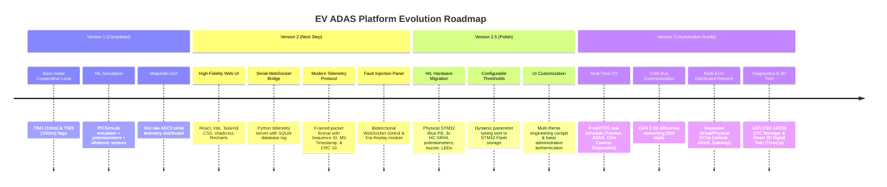
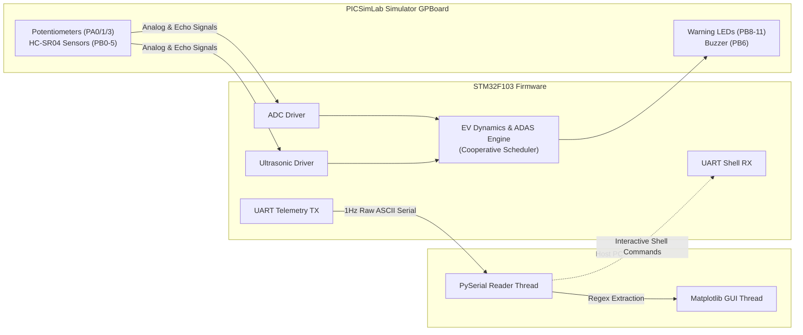
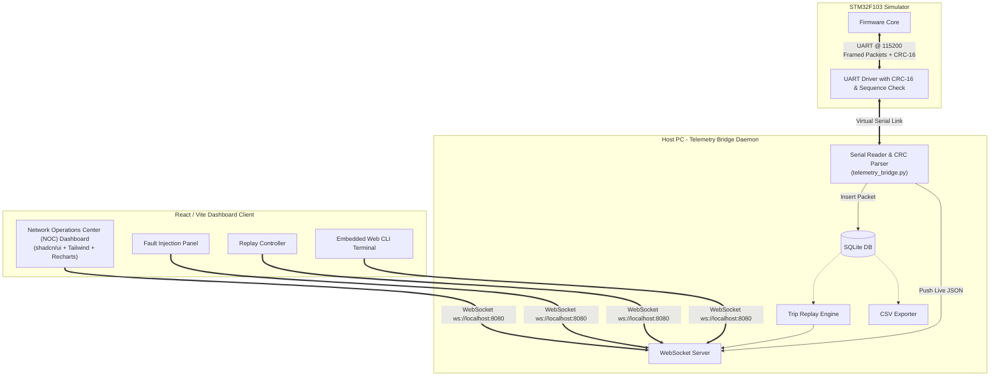

# Strategic Evolution Roadmap: EV ADAS Dashboard Platform

This document outlines the strategic product vision, architectural evolution, and technical roadmap for transforming the **EV ADAS Dashboard** from a simulated internship project into a production-grade, flagship **Automotive Embedded Systems Platform**. 

The roadmap is structured to demonstrate progression in **Firmware Architecture**, **Real-Time Systems**, **Automotive Protocols (CAN, UDS)**, **Full-Stack Telemetry**, and **Hardware-in-the-Loop (HIL) Integration**.

---

## 1. Project Vision

Modern electric vehicles (EVs) are no longer simple mechanical platforms; they are software-defined, safety-critical computers on wheels. A successful automotive engineer must understand not only low-level microcontrollers but also how telemetry flows from sensor edges, across robust network buses, through gateway processors, and into high-level diagnostics interfaces.

The **EV ADAS Dashboard Platform** is designed to mirror this exact data flow. By evolving this project, we transition from a localized, simulated microcontroller loop to a distributed, multi-ECU, real-time operating system (RTOS) hardware deployment. The ultimate goal is to build an open, visual, and highly authentic representation of an **Automotive Network Operations Center (NOC)** and diagnostic cockpit that showcases industry-standard engineering skills.

```
+---------------------------------------------------------------------------------------------------+
|                                     EV ADAS PLATFORM EVOLUTION                                    |
|                                                                                                   |
|  [V1: Simulated Base]      ===>      [V2: Web NOC & Protocol]     ===>     [V3: Multi-ECU Platform]   |
|   - Bare-Metal Loop                   - Serial-WebSocket Bridge             - FreeRTOS Preemption         |
|   - PICSimLab GPBoard                 - React / Vite / Tailwind UI          - Physical CAN Bus (2.0B)     |
|   - 1Hz UART ASCII                    - SQLite Telemetry Logging            - Split Vehicle/ADAS ECUs     |
|   - Matplotlib Dashboard              - 10Hz Packet CRC-16 Framed           - UDS DTC Fault Manager       |
+---------------------------------------------------------------------------------------------------+
```

---

## 2. Evolution Timeline

The system evolves through three major releases to ensure a structured, buildable, and modular path of execution.



---

## 3. Version Breakdowns

### Version 1: Simulated HIL Base (Completed)

This version represents the initial internship project. It establishes the mathematical models for electric vehicle dynamics and basic safety-critical ADAS calculations using virtualized hardware.



*   **Objectives**:
    *   Develop a cooperative rate-monotonic scheduler on a bare-metal ARM Cortex-M3 (STM32F103C8T6).
    *   Implement EV traction dynamics (Euler integration of torque and drag) and battery State-of-Charge (SOC) math.
    *   Process three ultrasonic range sensors to calculate Time-to-Collision (TTC) with hysteresis filtering.
    *   Establish a safety fault manager that transitions the vehicle to a `STATE_FAULT` safe state (contactor tripped, zero torque) upon motor overheat, dead battery, or critical collision.
*   **Major Deliverables**:
    *   STM32 bare-metal C codebase built with GCC/STM32CubeIDE.
    *   Matplotlib telemetry rendering dashboard (`ev_dashboard.py`).
    *   PICSimLab simulator configuration profile mapping virtual pins to sliders and indicators.
*   **Architecture Changes**:
    *   Introduced a single-core cooperative scheduler triggered by hardware timers: TIM1 (10ms) drives the EV dynamics engine; TIM3 (100ms) drives ADAS updates, fault checks, and command execution.
*   **Firmware Changes**:
    *   Drivers: regular multi-channel ADC polling, interrupt-based microsecond timing on TIM2 for HC-SR04 echo duration capture, ring-buffered UART interrupt handling.
    *   Application: state-machine logic transitioning between `STATE_PARKED`, `STATE_READY`, `STATE_DRIVING`, `STATE_REGEN`, and `STATE_FAULT`.
*   **Dashboard Changes**:
    *   A desktop Python Matplotlib application executing a serial-read background thread and a main-thread FuncAnimation loop to draw speedometer dials, bar charts, and a 2D bird's-eye view obstacle grid.
*   **Communication Changes**:
    *   Point-to-point UART over Virtual COM port at 115200 8N1.
    *   Telemetry frames are streamed at 1.0 Hz in ASCII format:
        *   `SPD:72.5 SOC:79.3 TRQ:75 TMP:27.1 RNG:260 ACC:50 BRK:0\r\n`
        *   `F:40 L:400 R:400 TTC:2.1s COL:1 BSD:00 ALM:2 FLT:04\r\n`
    *   Command interface parses raw string inputs (`mode sport`, `fault inject col`, `fault clear`).
*   **Expected Skills Demonstrated**: Embedded C programming, register-level/HAL configuration of microcontrollers, physical equation modeling in firmware, basic thread separation in Python.
*   **Estimated Difficulty & Timeline**: Medium | Completed (4 weeks).
*   **Milestones**:
    *   *Deliverables*: Core firmware folders ([Core/Src](file:///d:/Projects/Internship/Emertxe/ev_dash/Core/Src), [Core/Inc](file:///d:/Projects/Internship/Emertxe/ev_dash/Core/Inc)) and Python script ([ev_dashboard.py](file:///d:/Projects/Internship/Emertxe/ev_dash/ev_dashboard.py)).
    *   *GitHub Release*: `v1.0.0-simulation-release`
    *   *Demo Video*: Screencast showing PICSimLab sliders triggering speed changes and Matplotlib updates.
    *   *Screenshots*: Static image of the Matplotlib GUI cockpit and serial terminal feedback.
    *   *Documentation*: Base `README.md` and `ARCHITECTURE.md`.

---

### Version 2: Web NOC Dashboard & Telemetry Protocol (Highest Priority)

This version shifts focus to the visualization stack and communication security. It replaces the slow, blocking Matplotlib GUI with a modern, high-performance web dashboard inspired by professional Tesla, Bosch, and industrial SCADA monitoring systems. It also improves data integrity on the serial line.



*   **Objectives**:
    *   Build a high-performance, non-blocking React + Vite web dashboard displaying real-time telemetry.
    *   Create a Python-based middleware bridge that converts serial bytes to WebSockets and logs data.
    *   Redesign the telemetry protocol to include packet framing, timestamps, sequence counters, and a CRC-16 verification step to ensure data integrity.
    *   Enable telemetry recording and post-trip replay directly from the web browser.
    *   Build a graphical fault injection interface replacing command-line commands.
*   **Major Deliverables**:
    *   React Web App codebase (`/dashboard` using Vite, Tailwind CSS, shadcn/ui, Recharts).
    *   Python Serial-to-WebSocket bridge daemon (`telemetry_bridge.py`) utilizing SQLite database bindings.
    *   Updated STM32 firmware parsing and wrapping telemetry packets with a CRC-16-CCITT algorithm.
*   **Architecture Changes**:
    *   Decoupled serial processing from UI rendering. The Python daemon runs as a background service, handling high-rate serial port reading, SQLite insertions, and WebSocket broadcasts.
    *   The browser UI connects as a thin client over standard WebSockets (`ws://`), resolving the frame-rate bottlenecks of Matplotlib.
*   **Firmware Changes**:
    *   Telemetry transmission frequency increased from 1 Hz to 10 Hz (100ms update rate).
    *   Implemented CRC-16-CCITT (`polynomial = 0x1021`) generation in C. Telemetry buffers are compiled as packed structures, appended with CRC-16 checksums, and framed before transmission.
    *   Upgraded command interpreter to validate the CRC-16 of commands received from the Python bridge before triggering drive mode alterations or fault injections.
*   **Dashboard Changes**:
    *   **NOC Dashboard Design**: Grid-based layout featuring a dark mode interface, circular gauges for speed and torque, horizontal battery temperature/voltage scales, an alarm priority widget (highlighting flashing red, orange, and yellow blocks), and a live obstacle grid canvas.
    *   **Packet Statistics Pane**: Real-time counter showing total packets received, packets lost (calculated via Sequence ID gaps), CRC checksum errors, and connection latency.
    *   **Fault Center & Injection Grid**: Dedicated dashboard widget with toggle switches to inject faults (Overheat, Low SOC, Collision, Sensor Failure, Timeout) and buttons to send a `FAULT_CLEAR` signal.
    *   **Trip Replay Module**: UI panel allowing users to select a past recorded session from the SQLite archive, load it, and play it back with speed controls (1x, 2x, 5x) to review vehicle dynamics and ADAS trigger alerts.
*   **Communication Changes**:
    *   **Telemetry Frame Format**: Custom binary-framed packet (e.g., SLIP-framed) or high-reliability ASCII protocol:
        ```
        $[Timestamp_ms,Sequence_ID,Packet_Type,Payload_Data...,CRC16_Hex]*\n
        ```
        *   Example Telemetry Frame (`Packet_Type = 'D'`):
            `$[124500,432,D,72.5,79.3,75,27.1,260,50,0,F8AC]*`
        *   Example Command Frame (`Packet_Type = 'C'`):
            `$[124520,12,C,FLT_INJ,COL,B841]*`
    *   **WebSocket Protocol**: Lightweight JSON packets exchanged over local WebSockets port 8080:
        *   `{"event": "telemetry", "data": {"speed": 72.5, "soc": 79.3, "faults": "0x04", ...}}`
*   **Expected Skills Demonstrated**: Full-stack web development (React, State Management, Custom Hooks), WebSocket network programming, Database administration (SQLite, schema optimization), data verification algorithms (CRC-16), and event-driven Python programming.
*   **Estimated Difficulty & Timeline**: High | 6 Weeks.
*   **Milestones**:
    *   *Deliverables*: React dashboard web folder, `telemetry_bridge.py` service, updated C files (`uart_shell.c`, `main.c` incorporating CRC calculation).
    *   *GitHub Release*: `v2.0.0-web-telemetry`
    *   *Demo Video*: Video showing WebSocket connection activation, real-time Recharts scrolling, dynamic fault injection, and CSV export functionality.
    *   *Screenshots*: Dark mode dashboard dashboard screen, SQLite tables displaying logged timestamps, and Recharts performance overlays.
    *   *Documentation*: [V2_PROTOCOL.md] outlining exact packet structural byte sizes and WebSocket JSON payload schemas.

---

### Version 2.5: Physical Hardware HIL Integration (Intermediate Stage)

This version transitions the project from a purely emulated environment in PICSimLab to physical microcontroller hardware. This introduces real-world electrical signal noise, sensor tolerances, and hardware interfacing challenges.

```
+-----------------------------------------------------------------------------------------+
|                                    VERSION 2.5 HIL RIG                                  |
|                                                                                         |
|      +------------------+         Potentiometers (Accel / Brake / Temp)                 |
|      |                  | ----> [ PA0, PA1, PA3 Analog Inputs ]                         |
|      |                  |                                                               |
|      |                  |         HC-SR04 Ultrasonic Sensors                            |
|      |  STM32 Blue Pill | <---> [ PB0/1 (Front), PB2/3 (Left), PB4/5 (Right) ]          |
|      |  Target Hardware |                                                               |
|      |                  |         Actuators & Visualizers                               |
|      |                  | ----> [ PB6 PWM Buzzer ] | [ PB8/9/10/11 Warning LEDs ]        |
|      +------------------+                                                               |
|               |                                                                         |
|               +=== FTDI USB-UART Bridge ===> [ Host PC: React NOC Dashboard ]            |
+-----------------------------------------------------------------------------------------+
```

*   **Objectives**:
    *   Assemble a physical Hardware-in-the-Loop (HIL) test setup using an STM32F103C8T6 Blue Pill development board.
    *   Interface physical HC-SR04 ultrasonic sensors, linear potentiometers, a piezo buzzer, and status LEDs.
    *   Develop a browser interface to update safety thresholds and save them to the STM32's non-volatile flash memory.
    *   Add basic administrative login protection and multiple dashboard themes.
*   **Major Deliverables**:
    *   HIL hardware configuration schematic and assembly guide.
    *   Updated STM32 firmware including flash memory storage drivers (EEPROM emulation).
    *   React settings panel and login verification screen.
*   **Architecture Changes**:
    *   Replaced the virtual PICSimLab software loop with a physical board connecting to the host PC via a USB-to-TTL UART adapter (FTDI / CH340).
*   **Firmware Changes**:
    *   Rewrote the ultrasonic driver to use actual input capture timer channels (TIM2) or interrupt-driven pin polling, replacing virtual PICSimLab timing mocks.
    *   Configured a hardware timer (TIM4) to output a variable duty-cycle PWM signal, controlling the pitch and repeat rates of a physical alert buzzer based on ADAS hazard states.
    *   Implemented an EEPROM Emulation driver in the STM32 Flash memory space. This allows the system to store configurable thresholds (e.g., minimum TTC trigger times, over-temperature limits) that persist across system power cycles.
*   **Dashboard Changes**:
    *   **Configuration Portal**: Added a tab to view, edit, and transmit system parameters (e.g., Warning distance, over-temperature thresholds, sensor debounce loops) to the physical microcontroller.
    *   **Administrative Security**: Simple username/password login interface protecting configuration edits.
    *   **Theme Engine**: Introduced UI theme options including high-contrast green "Matrix" styling, "Steel Blue" industrial SCADA theme, and standard Light Mode.
*   **Communication Changes**:
    *   Added two bidirectional messages to the UART protocol:
        *   `SET_THRESH:[col_dist,temp_max,bsd_spd,ttc_crit]\n` (Sent from Web UI to update parameters).
        *   `ACK_THRESH:[status]\n` (Sent from STM32 to confirm settings are validated and written to flash).
*   **Expected Skills Demonstrated**: Board layout and circuit wiring, hardware debugging (oscilloscopes, multimeter analysis), input capture timer setup, PWM configuration, flash memory partition writes, application security, and dashboard themes.
*   **Estimated Difficulty & Timeline**: High | 4 Weeks.
*   **Milestones**:
    *   *Deliverables*: Hardware schematic (PDF), updated firmware containing flash routines, and the updated React application build.
    *   *GitHub Release*: `v2.5.0-hil-hardware`
    *   *Demo Video*: Video demonstrating a physical object approaching the sensor, triggering the hardware buzzer, and showing the updated distance indicators on the web dashboard.
    *   *Screenshots*: Photo of the physical breadboard/perfboard assembly, configuration page layout, and the login interface.
    *   *Documentation*: Wiring schematics and a Step-by-Step Sensor Calibration Guide.

---

### Version 3: Automotive Embedded Platform (Advanced Stage)

This version elevates the platform to automotive standards. It replaces the single bare-metal microcontroller scheduler with a real-time operating system (FreeRTOS), replaces point-to-point UART with a CAN Bus network, splits features across multiple ECUs, and adds standard automotive diagnostic services.

```mermaid
flowchart TB
    subgraph CAN_BUS [Physical CAN Bus Network - 500 kbps (CAN 2.0B)]
        CAN_H((CAN High))
        CAN_L((CAN Low))
    end

    subgraph ECU1 [Vehicle ECU - STM32 Blue Pill]
        RTOS1[FreeRTOS]
        DynEngine[EV Dynamics Engine]
        V_CAN[bxCAN Driver]
        DTC_M[DTC Diagnostic Manager]
        
        RTOS1 --> DynEngine & V_CAN & DTC_M
    end

    subgraph ECU2 [ADAS ECU - STM32 Blue Pill]
        RTOS2[FreeRTOS]
        ADAS[ADAS Engine]
        US_D[Ultrasonic Driver]
        A_CAN[bxCAN Driver]
        
        RTOS2 --> ADAS & US_D & A_CAN
    end

    subgraph ECU3 [Dashboard Gateway ECU - STM32 / Pi]
        G_CAN[bxCAN Driver]
        Bridge[Serial / USB Bridge]
        
        G_CAN --> Bridge
    end

    subgraph HostPC [Host PC]
        Daemon[telemetry_bridge.py]
        subgraph WebDashboard [React Dashboard]
            Twin[3D Digital Twin\nThree.js Engine]
            DTConsole[DTC Diagnostic Console]
        end
        Daemon --> WebDashboard
    end

    %% Network Connections
    V_CAN <==> CAN_BUS
    A_CAN <==> CAN_BUS
    G_CAN <==> CAN_BUS
    Bridge <==>|UART over USB| Daemon
```

*   **Objectives**:
    *   Migrate the cooperative firmware to FreeRTOS to implement preemptive multitasking.
    *   Replace point-to-point UART communication with a multi-node CAN Bus (CAN 2.0B) network.
    *   Distribute processing across three separate Electronic Control Units (ECUs) communicating over CAN.
    *   Implement an ISO 14229 (UDS) style Diagnostic Trouble Codes (DTC) manager.
    *   Add a 3D Digital Twin visualization component using WebGL/Three.js on the React dashboard.
*   **Major Deliverables**:
    *   Distributed multi-ECU firmware repository built with FreeRTOS.
    *   CAN database file (DBC-style) defining message structures and signals.
    *   React 3D digital twin visualization component (`/digital-twin` with Three.js).
    *   DTC lookup database and diagnostic interface.
*   **Architecture Changes**:
    *   Replaced the single-microcontroller architecture with a distributed, multi-node vehicle bus architecture. The system uses three physical or virtualized ECUs connected to a physical CAN Bus:
        1.  **Vehicle ECU**: Computes accelerator/brake inputs, runs EV dynamics, updates battery SOC, controls the high-voltage contactor, and tracks vehicle odometer metrics.
        2.  **ADAS ECU**: Monitors all range sensors, performs high-rate TTC calculations, manages hysteresis filters, and triggers alarms.
        3.  **Dashboard Gateway ECU**: Serves as a translator. It listens to CAN messages, packs them, and sends them to the host PC's WebSocket bridge over high-speed serial.
*   **Firmware Changes**:
    *   **FreeRTOS Integration**: Configured preemptive task scheduling:
        *   `vTaskEVDynamics` (10ms period, Priority = High): Processes pedal inputs and integrates vehicle speeds.
        *   `vTaskADASMonitor` (20ms period, Priority = High): Samples ultrasonic distances and evaluates crash risks.
        *   `vTaskCANComms` (50ms period, Priority = Medium): Queues and transmits CAN frames.
        *   `vTaskDiagnostics` (100ms period, Priority = Low): Monitors fault registers, logs diagnostic codes, and handles diagnostic queries.
    *   **bxCAN Driver Configuration**: Configured the STM32's built-in CAN peripheral to transmit and receive frames at 500 kbps. Implemented CAN identifier masking filters to ensure nodes only process relevant frames.
    *   **DTC Manager**: Implemented an OBD-II/UDS-compliant diagnostic database storing diagnostic trouble codes. Examples:
        *   `P0A80`: Battery pack temperature exceeded safe threshold (Latched Fault).
        *   `P0219`: Motor overspeed warning.
        *   `C1A00`: Sensor hardware timeout / range calculation failure.
        *   `U0100`: Communication timeout on CAN Bus.
        Each DTC is stored in non-volatile flash memory along with a **Freeze Frame** dataset (snapshot of Speed, SOC, and Temp captured at the moment of failure) to aid diagnostics.
*   **Dashboard Changes**:
    *   **3D Digital Twin**: Replaced the 2D bird's-eye view canvas with a WebGL 3D model of the vehicle. As telemetry updates, the model's wheels spin relative to vehicle speed, the chassis leans during deceleration, brake lights illuminate, and glowing radar waves indicate distance clearances around the car.
    *   **DTC Diagnostic Console**: Dedicated window displaying active and historical diagnostic trouble codes stored on the ECU. Allows engineers to click on a code to view its freeze-frame data or send a UDS clear command to wipe the code history.
*   **Communication Changes**:
    *   Point-to-point serial communication is replaced by a shared CAN Bus network.
    *   **CAN Frame Allocations**:
        *   `0x100` (Vehicle Status): [Speed (16-bit), SOC (16-bit), Torque (16-bit), State (8-bit), Contactor (8-bit)]
        *   `0x200` (ADAS Status): [Front Dist (16-bit), Left Dist (16-bit), Right Dist (16-bit), TTC (16-bit)]
        *   `0x300` (Diagnostics): [Active DTCs (32-bit bitfield), Alarm Priority (8-bit)]
        *   `0x7E0` / `0x7E8` (UDS Requests/Responses): Diagnostics request/response interface.
*   **Expected Skills Demonstrated**: RTOS implementation (Preemptive scheduling, Queues, Semaphores, Mutexes), CAN Bus peripheral drivers, CAN database (DBC) parsing, diagnostic standards (OBD-II, ISO 14229 UDS protocols), WebGL/Three.js 3D programming, and distributed systems architecture.
*   **Estimated Difficulty & Timeline**: Advanced | 8 Weeks.
*   **Milestones**:
    *   *Deliverables*: FreeRTOS firmware folder, CAN database DBC file, updated React package, and DTC log table.
    *   *GitHub Release*: `v3.0.0-automotive-platform`
    *   *Demo Video*: Video showing multiple STM32 nodes communicating over a physical CAN Bus, with traffic monitored on a logic analyzer, and the 3D dashboard displaying wheel rotation and live DTC diagnostics.
    *   *Screenshots*: 3D digital twin visualization rendering, CAN bus traffic trace from Wireshark/CANoe, and the DTC Diagnostic Console displaying logged DTC details.
    *   *Documentation*: CAN Message Dictionary (DBC spec), UDS Diagnostic Interface Guide, and the FreeRTOS Task Coordination Map.

---

## 4. Key Performance Indicators (KPIs) & Comparison

The table below illustrates how each version improves key performance metrics, transitioning the project from a student demonstration into a professional portfolio.

| Metric / Parameter | Version 1 (Simulation Base) | Version 2 (Web NOC & Protocol) | Version 2.5 (Physical HIL Rig) | Version 3 (Automotive Platform) |
|---|---|---|---|---|
| **Architecture** | Single Core Bare-Metal | Single Core + Web Client Bridge | Single Core + Physical Sensors | Multi-ECU Distributed Network |
| **Scheduler** | Cooperative Bare-Metal Loop | Cooperative Bare-Metal Loop | Cooperative Bare-Metal Loop | FreeRTOS Preemptive Tasks |
| **Telemetry Rate** | 1.0 Hz | 10.0 Hz | 10.0 Hz | 50.0 Hz (per CAN node broadcast) |
| **Integrity Checks**| None (Raw ASCII Regex) | CRC-16 Checksum verification | CRC-16 Checksum verification | CAN Hardware CRC-15 + UDS checks |
| **Physical IO** | Virtualized (PICSimLab) | Virtualized (PICSimLab) | Actual Hardware (Blue Pill, Sensors) | Distributed Hardware ECUs |
| **Communication** | Virtual UART Port (115200) | Virtual UART + WebSockets (115200) | Physical Serial + WebSockets (115200) | physical CAN Bus 2.0B (500 kbps) |
| **Database** | None | SQLite (continuous recording) | SQLite (continuous recording) | SQLite + ECU Non-Volatile Flash |
| **Diagnostics** | Basic UART ASCII Shell | Web-based CLI Shell | CLI + Remote Flash Config | OBD-II / UDS-like DTC Manager |
| **UI Rendering** | Matplotlib (Blocking, ~5 FPS) | React / Tailwind (WebSockets, >60 FPS) | React / Tailwind (WebSockets, >60 FPS) | React + Three.js 3D Twin (>60 FPS) |
| **Difficulty Level**| Medium | High | High | Advanced |
| **Development Time**| 4 Weeks (completed) | 6 Weeks | 4 Weeks | 8 Weeks |

---

## 5. Architectural & Design Philosophy

1.  **Safety-Critical Separation**: Low-level safety controls (ADAS thresholds, torque calculations, contactor triggers) must always run on the local microcontroller firmware. The host dashboard acts only as a monitor and command interface; it cannot override safety decisions.
2.  **Telemetry Decoupling**: We separate data collection from UI rendering. By inserting a WebSocket bridge and an SQLite database between the microcontroller and the browser, we prevent UI rendering delays from blocking telemetry data streams.
3.  **Automotive Standards Realism**: The transition from UART to a CAN Bus network and UDS-compliant DTC diagnostic logging mirrors the design patterns of production vehicles. This makes the project directly applicable to automotive engineering roles.
4.  **Hardware-in-the-Loop Validation**: Operating on real hardware forces us to address electrical noise, sensor calibration challenges, and serial port connection issues, proving the code is stable in physical environments.

---

## 6. Ideas Intentionally Excluded (Out of Scope)

*   **Autonomous Driving / Steering Automation**:
    *   *Reason*: Autonomous steering requires specialized actuators and complex computing platforms (such as ROS or Nvidia Drive) that shift the focus away from microcontrollers and firmware.
*   **Computer Vision / YOLO Camera Integration**:
    *   *Reason*: Object detection using cameras requires high-power processors (such as Raspberry Pi or Jetson Nano) rather than microcontrollers. The ADAS functions remain focused on ultrasonic sensor processing.
*   **Wireless Cloud Connectivity (WiFi/Cellular)**:
    *   *Reason*: Evolving to a cloud platform introduces unrelated web security and database challenges. Storing data locally on an SQLite database is sufficient for vehicle telemetry analysis.

---

## 7. Portfolio Value & Career Alignment

Evolving this project builds a strong portfolio that demonstrates:
*   **Version 2**: Competence in data ingestion pipelines, WebSocket APIs, databases, and modern web application development.
*   **Version 2.5**: Hands-on experience with hardware integration, sensor calibration, timer capture registers, and non-volatile memory management.
*   **Version 3**: Expertise in real-time operating systems (FreeRTOS), CAN bus protocol design, and industry-standard automotive diagnostics (OBD-II/UDS).

Completing this roadmap transforms a basic internship project into a professional-grade embedded systems platform.
