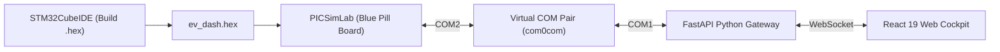

# PICSimLab HIL Simulation & Testing Guide (v2.2)

---

## 1. Overview

This guide provides step-by-step instructions for configuring **PICSimLab**, virtual COM port loopbacks, and simulated analog/digital peripherals to run the **EV ADAS Embedded Software Platform** without physical microcontroller hardware.

---

## 2. Environment Setup

### 1. Install PICSimLab
* Download and install **PICSimLab** (v0.9.0 or later) from [https://lcgamboa.github.io/picsimlab/](https://lcgamboa.github.io/picsimlab/).

### 2. Configure Virtual COM Port Pair (Windows)
* Install **com0com** (or an equivalent virtual serial port driver).
* Create a linked pair: `COM1 <-> COM2`.
* `COM2` will be assigned to PICSimLab.
* `COM1` will be assigned to the Python telemetry bridge (`bridge.py`).

---

## 3. PICSimLab Board & Peripheral Configuration

1. Launch **PICSimLab**.
2. Go to **File** $\rightarrow$ **Board** $\rightarrow$ Select **STM32F103C8T6 (Blue Pill)**.
3. Configure the virtual serial interface:
   * Go to **Modules** $\rightarrow$ **Serial Port**.
   * Set Port: **`COM2`**, Baud Rate: **`115200`**, Parity: **`None`**, Data Bits: **`8`**, Stop Bits: **`1`**.
4. Attach Peripheral Components via **Modules / Spare Parts**:
   * **Potentiometers**:
     * Connect Potentiometer 1 to Pin `PA0` (Accelerator Demand: $0.0\text{V} - 3.3\text{V}$).
     * Connect Potentiometer 2 to Pin `PA1` (Brake Demand: $0.0\text{V} - 3.3\text{V}$).
     * Connect Potentiometer 3 to Pin `PA3` (Motor Temperature: $0.0\text{V} = 25^\circ\text{C}$, $3.3\text{V} = 120^\circ\text{C}$).
   * **Ultrasonic Distance Sensors (HC-SR04)**:
     * Front Sensor: `TRIG` $\rightarrow$ `PB0`, `ECHO` $\rightarrow$ `PB1`.
     * Left Sensor: `TRIG` $\rightarrow$ `PB2`, `ECHO` $\rightarrow$ `PB3`.
     * Right Sensor: `TRIG` $\rightarrow$ `PB4`, `ECHO` $\rightarrow$ `PB5`.
   * **Passive Buzzer**:
     * Connect Buzzer signal input to Pin `PA8` (`TIM1_CH1` PWM output).
     * Connect Ground to `GND`.
   * **Status LEDs**:
     * `PB8`: Collision Warning LED.
     * `PB9`: Blind Spot Left LED.
     * `PB10`: Blind Spot Right LED.
     * `PB11`: Motor Contactor Trip / Fault LED.

---

## 4. Test & Verification Scenarios

### Scenario A: Acceleration & Powertrain Kinematics
1. Turn Potentiometer 1 (`PA0`) up to 50%.
2. Verify vehicle speed increases smoothly toward $\sim 80\text{ km/h}$.
3. Turn Potentiometer 2 (`PA1`) up to 40%.
4. Verify regenerative braking engages, slowing the vehicle down while recapturing energy.

### Scenario B: Forward Collision Warning & Hardware Siren
1. In the PICSimLab Front Ultrasonic module, set the obstacle distance to `40 cm`.
2. Verify the dashboard triggers a yellow **FCW Warning**, and the buzzer outputs a pulsed $1.2\text{ kHz}$ warning tone.
3. Reduce the obstacle distance to `15 cm`.
4. Verify the dashboard transitions to a red **FCW Critical Alarm**, the buzzer immediately transitions to an urgent $2.5\text{ kHz}$ siren, and the contactor trips (`PB11` LED ON).

### Scenario C: Motor Over-Temperature Shutdown & DTC Freeze Frame
1. Turn Potentiometer 3 (`PA3`) up so temperature exceeds $80^\circ\text{C}$.
2. Verify vehicle immediately enters `STATE_FAULT`, trips the contactor, and commands the $2.5\text{ kHz}$ siren.
3. In the Serial Inspector CLI, type `dtc read`.
4. Confirm DTC `P0A80` is displayed with the exact speed, SOC, and temperature freeze-frame metrics recorded at the moment of shutdown.
5. In the CLI, type `fault clear` to reset the latching fault.

### Scenario D: Flash NVM Parameter Calibration
1. In the Serial Inspector CLI, type `config read`.
2. Confirm the default `FCW Warning Distance` is `50.0 cm`.
3. In the CLI, type `set fcw_warn 70`.
4. Confirm the response `OK (Saved to NVM Flash)`.
5. Press the **Reset** button in PICSimLab.
6. After MCU reboot, type `config read` again.
7. Confirm that `FCW Warning Distance` remains `70.0 cm` (verified persistent in Flash Page 63).
